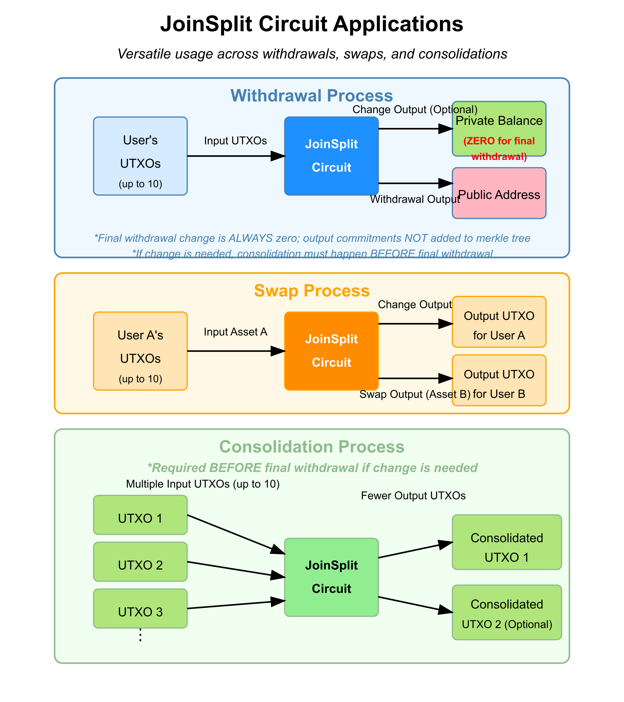

# DVP Technical Documentation

Author: Pedro Manuel Pereira
Last Updated (Date - Rayls Version): 13/01/2026 - 2.6.2

Sources: Research Team Docs; Aegis: Privacy-Preserving Market for Non-Fungible Tokens - Hisham S. Galal, Amr M. Youssef, Senior Member, IEEE, Rayls Codebase

The purpose of this document is to provide a technical coverage of how DVP operates.

**TABLE OF CONTENTS**
- [DVP Technical Documentation](#dvp-technical-documentation)
  - [1. Introduction](#1-introduction)
    - [1.1 Basic DVP Functionality and Casino Tokens Analogy](#11-basic-dvp-functionality-and-casino-tokens-analogy)
  - [2. Definitions](#2-definitions)
    - [2.1 Hash Function](#21-hash-function)
      - [2.1.1 SHA-3 (Keccak)](#211-sha-3-keccak)
        - [SHA-3 (Keccak) Examples](#sha-3-keccak-examples)
      - [2.1.2 Poseidon](#212-poseidon)
        - [Poseidon Hash Examples](#poseidon-hash-examples)
    - [2.2 Coin](#22-coin)
      - [2.2.1 Coin Examples](#221-coin-examples)
      - [2.2.2 Coin Structure](#222-coin-structure)
        - [secretKey](#secretkey)
        - [publicKey](#publickey)
        - [uniqueId](#uniqueid)
        - [commitment](#commitment)
        - [nullifier](#nullifier)
    - [2.3 Merkle Tree](#23-merkle-tree)
      - [2.3.1 Merkle Tree Organization](#231-merkle-tree-organization)
      - [2.3.2 Path Indices and Tree Depth](#232-path-indices-and-tree-depth)
    - [2.4 Asset Groups](#24-asset-groups)
    - [2.5 Unspent Transaction Output (UTXO) Model](#25-unspent-transaction-output-utxo-model)
  - [3. DVP Main Actions](#3-dvp-main-actions)
    - [3.1 Deposit Enygma to DVP](#31-deposit-enygma-to-dvp)
      - [3.1.1 Purpose of DepositToDvp](#311-purpose-of-deposittodvp)
      - [3.1.2 The DepositToDvp Circuit](#312-the-deposittodvp-circuit)
      - [3.1.3 Contract Functions used when Depositing Enygma to DVP](#313-contract-functions-used-when-depositing-enygma-to-dvp)
    - [3.2 Withdraw Enygma from DVP](#32-withdraw-enygma-from-dvp)
      - [3.2.1 Purpose of WithdrawFromDvp](#321-purpose-of-withdrawfromdvp)
      - [3.2.2 The WithdrawFromDvp Circuit (And Also Reference to Join-Split Circuit)](#322-the-withdrawfromdvp-circuit-and-also-reference-to-join-split-circuit)
      - [3.2.3 Contract Functions used when Withdrawing Enygma from DVP](#323-contract-functions-used-when-withdrawing-enygma-from-dvp)
    - [3.3 Swap](#33-swap)
      - [3.3.1 Purpose](#331-purpose)
      - [3.3.2 The JoinSplit Circuit For Enygma](#332-the-joinsplit-circuit-for-enygma)
        - [Circuit Implementation](#circuit-implementation)
        - [Circuit Configuration](#circuit-configuration)
        - [Public Signals](#public-signals)
        - [Components and Verification Flow](#components-and-verification-flow)
      - [3.3.3 The OwnershipProof Circuit for ERC721](#333-the-ownershipproof-circuit-for-erc721)
        - [OwnershipErc721 Implementation](#ownershiperc721-implementation)
        - [Circuit Implementation](#circuit-implementation-1)
        - [Circuit Configuration](#circuit-configuration-1)
        - [Public Signals](#public-signals-1)
        - [Key Components and Verification Flow](#key-components-and-verification-flow)
        - [Differences from ERC20 Template](#differences-from-erc20-template)
        - [Implementation Details](#implementation-details)
      - [3.3.4 Contract Functions used when Swapping ERC721-Enygma](#334-contract-functions-used-when-swapping-erc721-enygma)
      - [3.3.5 The JoinSplit Circuit For ERC1155](#335-the-joinsplit-circuit-for-erc1155)
        - [Circuit Implementation](#circuit-implementation-2)
        - [Circuit Configuration](#circuit-configuration-2)
        - [Public Signals](#public-signals-2)
        - [Components and Verification Flow](#components-and-verification-flow-1)
        - [ERC1155-Specific Features](#erc1155-specific-features)
      - [3.3.6 Contract Functions used when Exchanging ERC1155-Enygma](#336-contract-functions-used-when-exchanging-erc1155-enygma)
        - [Key Differences from ERC721-Enygma Swaps](#key-differences-from-erc721-enygma-swaps)
  - [4. Implementation Details](#4-implementation-details)
    - [4.1 Interaction among PNH (Enygma DvP and Verifier Contract and On-Chain Merkle Tree) \<-\> Relayer/DB (Deposit and MerkleTree DB) \<-\> PNs (Handlers)](#41-interaction-among-pnh-dvp-and-verifier-contract-and-on-chain-merkle-tree---relayerdb-deposit-and-merkletree-db---pls-handlers)
      - [4.1.1 Components and Interactions](#411-components-and-interactions)
        - [Private Network Hub (PNH) Components](#private-network-hub-pnh-components)
        - [Relayer/Database Layer/Proof API (Gnark)](#relayerdatabase-layerproof-api-gnark)
        - [Privacy Node (PN) Components](#privacy-node-pn-components)
      - [4.1.2 Proof Verification Flow](#412-proof-verification-flow)
      - [4.1.3 Key Transaction Flows](#413-key-transaction-flows)
        - [Deposit Flow](#deposit-flow)
        - [Withdrawal Flow](#withdrawal-flow)
        - [Swap Flow (Fungible-to-NonFungible)](#swap-flow-fungible-to-nonfungible)
        - [Exchange Flow (Fungible-to-Fungible)](#exchange-flow-fungible-to-fungible)
      - [4.1.4 Communication Mechanisms](#414-communication-mechanisms)
    - [4.2 Interaction between Enygma Contract and Dvp Contract](#42-interaction-between-enygma-contract-and-dvp-contract)
      - [4.2.1 EnygmaDvpIntegration: The Connector](#421-enygmadvpintegration-the-connector)
      - [4.2.2 Dvp Balance](#422-dvp-balance)
      - [Dvp Balance Tracking](#dvp-balance-tracking)
    - [4.3 Consolidation Edge Case](#43-consolidation-edge-case)
      - [Solution Breakdown](#solution-breakdown)
  - [4.4 DVP Programmability](#44-dvp-programmability)
  - [5. What is Missing and WIP](#5-what-is-missing-and-wip)

## 1. Introduction

### 1.1 Basic DVP Functionality and Casino Tokens Analogy

Each asset inside the Dvp contract is represented by a 'Coin' structure that is registered in a Merkle Tree, see [2.3 Merkle Tree](#23-merkle-tree). See the properties of a Coin in [2.2 Coin](#22-coin). A coin might represent 1 Enygma token that corresponds to 1 USD, 10 Enygma tokens that correspond to 10 EUR, or even a single ERC721 NFT that represents ownership of a specific asset.

The core purpose of Dvp is to enable swapping between two coins that can represent completely different asset types. This allows for diverse exchange combinations such as ERC20-ERC721 swaps or ERC721-ERC1155 swaps. While ERC20-ERC721 and ERC20-ERC1155 exchanges have been thoroughly battle-tested, the protocol is fundamentally asset-agnostic, meaning the specific asset type represented by each coin doesn't matter in principle.

This system works similarly to exchanging fiat currency for casino chips—you convert your assets to coins, perform various swaps within the system, and eventually exchange your coins back for whatever assets they represent. As with many privacy protocols (Tornado Cash being a notable example), Dvp is designed to keep transactions private and difficult to trace. For this reason, users should avoid immediately withdrawing assets after completing a swap, as this behavior can create correlations that compromise privacy. It is advisable to keep coins within the Dvp system for some time after a swap is completed.

## 2. Definitions

### 2.1 Hash Function

A hash function is a mathematical function that takes an input (or "message") of any size and transforms it into a fixed-size string of characters, usually a sequence of numbers and letters. In this project, **Poseidon** is used as the primary hash function for all Dvp operations due to its efficiency in zero-knowledge proof systems. Keccak (SHA-3) is used in some auxiliary operations but not for core coin key generation.

#### 2.1.1 SHA-3 (Keccak)

SHA-3 (Secure Hash Algorithm 3) is the latest member of the Secure Hash Algorithm (SHA) family, standardized by NIST in 2015. It stands out because it introduces a fundamentally different internal design compared to its predecessors (SHA-1 and SHA-2).

##### SHA-3 (Keccak) Examples

SHA-3 produces a fixed-size output regardless of input length. It's available in several output sizes: 224, 256, 384, and 512 bits. Here are examples using SHA-3-256 (which produces a 256-bit/32-byte output):

| Input | SHA-3-256 Output (64 hex characters = 32 bytes = 256 bits) |
| ----- | ---------------------------------------------------------- |
| "hello" | a7ffc6f8bf1ed76651c14756a061d662f580ff4de43b49fa82d80a4b80f8434a |
| "blockchain" | 7daeff454f701c6ac16d22b4d392912fae1f8da6c5d2c65f0a055c849c51a3c2 |
| "zero-knowledge" | f1502ed90b9c7d352a779976886ae7587fb924f4be2a001d406a2e40e11e31db |
| "This is a much longer input string to demonstrate that the output size remains fixed regardless of how much data we input into the SHA-3 hash function." | 4ed9d2c4651827f14c17783971d9792f18c3e639e48b14c38c8bdc3dde3c8126 |

**Key point**: Notice how SHA-3-256 always produces exactly 256 bits (64 hexadecimal characters) of output, regardless of whether the input is short or long.

#### 2.1.2 Poseidon

Poseidon is a cryptographic hash function specifically designed for use in zero-knowledge proof (ZKP) systems, such as zk-SNARKs and zk-STARKs. It is optimized for efficiency in field-based arithmetic, making it particularly well-suited for applications in blockchain and privacy-preserving technologies.

Traditional hash functions are computationally expensive in field-based cryptographic environments. Poseidon, on the other hand, is designed from the ground up to be efficient in these specific settings, enabling faster and more cost-effective proofs in zero-knowledge systems such as SNArKs. That's why we use Poseidon for our Dvp coin keys generation.

##### Poseidon Hash Examples

Poseidon also produces a fixed-size output. For these examples, I'll use Poseidon in a common configuration for zkSNARK applications over the BN254 curve (with output in the field modulo a 254-bit prime):

| Input | Poseidon Output (64 hex characters representing a field element) |
| ----- | --------------------------------------------------------------- |
| 123 | 0x0618809da8ba4947dfddceb15eb180f3a653fe3d1c5d2502e11d86109a0fc856 |
| [123, 456] | 0x17f52740162e4562e919dbaf9e7ac899654aeab318cc63c31d771a6d1ad05ee9 |
| [1, 2, 3, 4, 5] | 0x1bfd8a87ff7d44a4b2818ebb86b9ef5bea1610b5538fd65bb7879071ed2ae214 |
| [9999, 8888, 7777, 6666, 5555] | 0x1574e1b200dc6ef0ce6bf27a4c1bf7dfb474d42ad850fd874f7c37d5e99ef6a6 |

**Key point**: The Poseidon hash always outputs a single field element (in this case, represented as a 256-bit hexadecimal number) regardless of how many elements are in the input array.

For Dvp coin keys generation, Poseidon's field-friendly properties make it particularly well-suited as it dramatically reduces the computational cost in zero-knowledge proof systems while maintaining cryptographic security.

### 2.2 Coin

Coin is the basic unit of the Dvp system. Any type of assets (fungible or non-fungible) is converted into a Coin structure to be used in a swap.

#### 2.2.1 Coin Examples

A coin can represent:

+ Some amount of a ERC20 based fungible token - Enygma.
+ One ERC721-based non-fungible token with a unique Id.
+ A Fungible (totalAmount != 1) or non-fungible (totalAmount = 1) ERC1155 token.

A coin **CANNOT** represent a mixture of multiple types of assets.

#### 2.2.2 Coin Structure

A coin consists of the following components:

- secretKey
- publicKey
- uniqueId
- commitment
- nullifier

##### secretKey

A random number that is a field element in the BN254 curve's scalar field, which is a 254-bit prime field with modulus:
```markdown
JubJubPrimeGroupPrime=21888242871839275222246405745257275088548364400416034343698204186575808495617
```
the Baby Jubjub prime field. We generate this secretKey by generating a 256-bit random number (using a SHA-3-256 of the chainId of the user and the current time as seed) and then reducing it modulo the JubJubPrimeGroupPrime which is 254 bit number. See functions `CreateEnygmaDvpKeyPair` and `GenerateRandomModJubJubPrimeGroupWithChainId` in the relayer code.

##### publicKey
It is the Poseidon hash of secretKey. See function `CreateEnygmaDvpKeyPair` in the relayer code.
```markdown
publicKey = PoseidonHash(secretKey)
```

##### uniqueId
It is a unique ID based on the represented token's amount/id and smart contract address.


For ERC20/Enygma:
```markdown
uniqueId = PoseidonHash(tokenContractAddress, amount)
```

For ERC721:
```markdown
uniqueId = PoseidonHash(ntfID, erc721ContractAddress)
```


For ERC1155:
```markdown
uniqueId = PoseidonHash(PoseidonHash(erc1155ContractAddress, tokenID), amount)
```


##### commitment
This component represents a binding, cryptographic commitment to a coin in the Dvp system. Unlike Enygma's Fully Homomorphic Encryption (FHE) commitments, Dvp commitments use the Poseidon hash function to shield asset information while still enabling zero-knowledge verification. Fully Homomorphic Encryption (FHE) allows computations to be performed directly on encrypted data without decryption, whereas Dvp commitments are one-way cryptographic bindings that conceal information but don't support mathematical operations on the concealed values themselves.
When a commitment is created, it permanently binds together the asset's uniqueId and the owner's publicKey without revealing their actual values:

```markdown
commitment = PoseidonHash(uniqueId, publicKey)
```

The resulting commitment value is stored on-chain in the appropriate Merkle tree, allowing users to prove ownership or transfer assets without exposing sensitive details about the underlying assets. This commitment mechanism is what enables privacy-preserving operations within the Dvp ecosystem while maintaining asset integrity.
Each commitment effectively represents an asset in its "shielded form" - whether that's Enygma tokens, ERC721 NFTs, or other supported asset types - allowing them to be verifiably exchanged through zero-knowledge proofs while keeping their specific details private.

##### nullifier
This parameter can only be generated by the user since it uses secretKey and pathIndices - the "coordinates" of a commitment in an on-chain merkle tree, see [2.3.2 Path Indices and Tree Depth](#232-path-indices-and-tree-depth), and only they have access to these. The spending of a coin is then anonymous. The user will know their coin has been spent when the Nullifier event is triggered with a value that matches what they calculated. Nullifiers should be kept secret.
```markdown
nullifier = PoseidonHash(secretKey, pathIndices)
```

### 2.3 Merkle Tree
In Dvp, MerkleTree has been used to efficiently store and prove the membership of commitments on-chain. It is a binary tree where each leaf node contains the cryptographic hash of a piece of data, and every non-leaf node contains the hash of the concatenation of its child nodes. 

For four pieces of data A, B, C, and D:
```
                  Merkle Root
                    H(ABCD)
                   /       \
             H(AB)          H(CD)
            /   \          /   \
         H(A)  H(B)     H(C)  H(D)
        H(AB) = H(H(A) || H(B))
        H(CD) = H(H(C) || H(D))
        Merkle Root = H(H(AB) || H(CD))
```

#### 2.3.1 Merkle Tree Organization

- To support different types of assets, each asset deployed to the Private Network Hub is accompanied by its own dedicated **CoinVault** and **Merkle Tree**. The CoinVault acts as the holder of all deposits for that asset and manages the asset's Merkle tree structure.
- The `vaultId` parameter identifies which CoinVault (and its associated Merkle tree) is being referenced. Vaults are registered via `Dvp.registerVault()` which assigns a unique `vaultId` starting from 1.
- You can lookup the `vaultId` for a given token contract address using `Dvp.getVaultIdByAddress(contractAddress)`.
- To support an infinite number of coin registrations, we keep creating new sub-trees within each asset's Merkle tree structure and track valid Merkle roots. The `treeNumber` parameter represents the index of the sub-tree within an asset's vault.

**CoinVault Types:**

- **EnygmaCoinVault**: Handles Enygma token deposits/withdrawals. Deposits receive a pre-computed commitment hash from the Enygma integration layer.
- **Erc721CoinVault**: Handles ERC721 NFT deposits/withdrawals. Generates commitments from `nftId` and user's `publicKey`.
- **Erc1155CoinVault**: Handles ERC1155 token deposits/withdrawals. Generates commitments from `tokenId`, `amount`, and user's `publicKey`.
- **Erc20CoinVault**: Handles generic ERC20 token deposits/withdrawals.

#### 2.3.2 Path Indices and Tree Depth
In our implementation, we use a tree depth of `8`, which means:

- The tree can store up to 2^8 = 256 leaf nodes (commitments)
- The height of the tree is 8 levels (from leaves to root)
- Each leaf has a unique path to the root


**Path Indices** are critical for both proving membership and preventing double-spending:

1. **Binary Path Representation**: The path from a leaf to the root can be represented as a binary number of length 8 (for our tree depth). Each bit in this number indicates whether to take the left (0) or right (1) branch at each level when traversing from the root to the leaf.

2. **Numerical Representation**: This binary path is converted to a decimal number, which becomes the `pathIndices` value used in nullifier calculation.

3. **Usage in Zero-Knowledge Proofs**: The path indices encode the exact position of a commitment in the Merkle tree without directly revealing it. For example, in a 3-level tree:

   ```
                Root (R)
               /      \
             A          B
            / \        / \
           C   D      E   F
   ```

   If your commitment is at node E, your path from root would be:
   - Level 1: Take right branch from Root (1)
   - Level 2: Take left branch from B (0)
   
   This gives path indices `10` in binary (reading from root to leaf) or `2` in decimal. Inside the zero-knowledge proof, you prove you know this path and the corresponding sibling hashes (A at level 1 and F at level 2) without revealing which specific leaf you're referencing.

4. **Role in Nullifier Generation**: The path indices are used as part of the nullifier calculation (combined with the secretKey). This ensures that:
   - Each leaf position in the tree creates a unique nullifier
   - The nullifier cannot be created without knowing both the secret key and the exact position in the tree
   - The same coin commitment in different positions would have different nullifiers

**Path Elements** are the sibling hashes along the path from a leaf to the root. While path indices tell you which direction to take at each level, path elements provide the sibling hashes needed to verify the path:

- For a tree of depth 8, there are 8 path elements (one for each level)
- Each path element is the hash of the sibling node at that level
- Path elements are used within the zero-knowledge circuit to reconstruct and verify the Merkle root

**Important Note on Vault Architecture and Nullifiers:**

With the new architecture where each asset has its own dedicated CoinVault and Merkle Tree, nullifier isolation is naturally achieved at the vault level. The `treeNumber` is not directly used in the nullifier calculation:

```javascript
function getNullifier(privateKey, pathIndices) {
  return poseidon([privateKey, pathIndices]);
}
```

While the same commitment with the same private key at the same path index in different sub-trees would theoretically generate the same nullifier, the Enygma DvP system addresses this by:

1. Each CoinVault maintains its own nullifier registry, preventing cross-vault collisions
2. Including the `vaultId` and `treeNumber` in the proof data returned for verification
3. Ensuring that nullifiers are tracked per-vault, so the same nullifier value in different vaults is not a conflict

The fixed tree depth of 8 represents a balance between:

- Storage efficiency (smaller trees require less on-chain storage)
- Operational convenience (manageable number of leaves per tree)
- Privacy considerations (sufficient anonymity set)

When one sub-tree within a vault fills up, a new sub-tree (with a new `treeNumber`) is created, allowing the system to scale indefinitely while maintaining consistent proof generation and verification processes.

### 2.4 Asset Groups

Asset Groups are used to categorize assets by their fungibility type and enable proper validation during swap and exchange operations. The Dvp system uses two primary asset groups:

1. **Fungibles (Group 0)**: Contains assets that are fungible in nature
   - Enygma tokens
   - ERC1155 tokens (currently registered as fungible)
   - ERC20 tokens

2. **NonFungibles (Group 1)**: Contains assets that are non-fungible
   - ERC721 tokens

Each asset group maintains its own Merkle tree for membership tracking. During swap/exchange operations, the Dvp contract verifies that the assets involved belong to compatible asset groups.

**Asset Group Registration and Pairing:**

Asset groups are registered via `Dvp.registerAssetGroup()` and can form pairs for different operation types:

- **Swap Group Pairs** (`registerSwapGroupPair`): For fungible-to-non-fungible swaps (e.g., Enygma for ERC721)
- **Exchange Group Pairs** (`registerExchangeGroupPair`): For fungible-to-fungible exchanges (e.g., Enygma for ERC1155)

**Membership Types:**

The system supports two types of membership:

1. **Vault-Level Membership** (`addVaultToGroup`, `isVaultMemberOf`): Registers an entire vault to an asset group. All tokens in that vault are considered members.
2. **Token-Level Membership** (`addTokenToGroup`, `isTokenMemberOf`): Registers specific tokens (by uniqueId) to an asset group. Useful for fine-grained control.

**Current Asset Registration:**

- When an **Enygma** token is deployed, its CoinVault is registered to the **Fungibles** asset group via vault-level membership
- When an **ERC1155** token is deployed, its CoinVault is registered to the **Fungibles** asset group (treating all ERC1155 as fungible)
- When an **ERC721** token is deployed, its CoinVault is registered to the **NonFungibles** asset group

**Future Considerations for Non-Fungible ERC1155:**

The ERC1155 standard supports both fungible tokens (amount > 1) and non-fungible tokens (amount = 1). Currently, all ERC1155 tokens are treated as fungible in the Dvp system. Implementing proper non-fungible ERC1155 support requires the following changes:

1. **Circuit Updates**: The ERC1155 circuit needs to include the asset group merkle root as a public input, allowing verification that a token belongs to the correct fungibility group
2. **Vault Validation**: The `Erc1155CoinVault.checkReceiptConditions()` needs additional validation to ensure the proof type matches the expected fungibility (cannot use fungible proof for non-fungible token)
3. **Token-Level Registration**: Enable token-level registration to asset groups (currently using vault-level membership as a temporary fix)
4. **Fungibility Tracking**: The token contract (`DvpErc1155PNH`) already tracks fungibility per tokenId via `tokenIsFungible` mapping - this needs to be utilized during proof verification
5. **VK Selection**: Use appropriate verification keys based on fungibility: `VK_ID_ERC1155_1` for non-fungible and `VK_ID_ERC1155_2`/`VK_ID_ERC1155_FUNG_1` for fungible

### 2.5 Unspent Transaction Output (UTXO) Model

The Unspent Transaction Output (UTXO) model tracks ownership of assets by recording individual transaction outputs that haven't yet been spent as inputs to new transactions. Bitcoin uses this ledger model.

Dvp naturally operates under this model by representing each asset as a discrete "coin" with its own commitment that can only be spent once (tracked through nullifiers), allowing users to join multiple inputs and split into multiple outputs, see [3.3.2 The JoinSplit Circuit For Enygma](#332-the-joinsplit-circuit-for-enygma), while maintaining privacy - essentially functioning as a privacy-preserving UTXO system where commitments represent the unspent outputs and nullifiers prevent double-spending.

## 3. DVP Main Actions

Here we describe the Contract Functions and circuits used in each action.

### 3.1 Deposit Enygma to DVP

A Deposit transaction into Dvp extends beyond a simple Enygma transfer by incorporating additional cryptographic operations. The key distinction is that the total value in the transaction is negative (-v), reflecting the movement of value from Enygma into the Dvp environment.

Conceptually, this process can be understood as Enygma tokens being removed from circulation while simultaneously creating a Dvp coin of equivalent value. This newly created coin inherits all the privacy properties of the Dvp system, allowing for anonymous transactions with the deposited value.

#### 3.1.1 Purpose of DepositToDvp

This circuit validates a deposit transaction, ensuring:

- The deposit amount is properly verified and a nullifier is generated for this specific transaction
- The enygma transaction commitments are correctly formed
- A valid Dvp commitment is generated for the deposit

#### 3.1.2 The DepositToDvp Circuit

1. **Deposit Amount Handling**:
   - In Enygma, value `v` represents transfer between accounts
   - In DepositToDvp, value `v` represents amount being deposited into the system

2. **Transaction Sum Verification**:
   - Enygma: `sum(tx_value[i]) == 0` (zero-sum transaction)
   - DepositToEnygmaDvp: `sum(tx_value[i]) == -v` (sum equals negative of deposit amount)

3. **Hash Verification**:
   - Includes verification of a single hash to validate the deposit

Most components are similar to Enygma, but with these key differences:

*Deposit Amount Verification*

```go
// Gnark circuit implementation
selected_v := frontend.Variable(0)
for i := 0; i < k; i++ {
    diff := api.Sub(senderId, kIndex[i])
    eq := api.IsZero(diff)
    selected_v = api.Add(selected_v, api.Mul(eq, txValue[i]))
}
negativeV := api.Sub(JubJubPrimeSubGroup, v)
api.AssertIsEqual(selected_v, negativeV) // Check if v is negative of the selected tx_value
```

- **Purpose**: Verifies that `v` (deposit amount) equals the negative of sender's value in tx_value array.

*Transaction Value Sum*

```go
sumTx := frontend.Variable(0)
for i := 0; i < k; i++ {
    sumTx = api.Add(sumTx, txValue[i])
}
negativeV := api.Sub(JubJubPrimeSubGroup, v)
api.AssertIsEqual(sumTx, negativeV)
```

- **Purpose**: Ensures that the sum of transaction values equals the negative of deposit amount.

*Commitment Hash Verification (Unique to DepositToDvp)*

```go
// Using Gnark's Poseidon implementation
uid := pos.Poseidon(api, []frontend.Variable{address, v})
calculatedHash := pos.Poseidon(api, []frontend.Variable{uid, pk})

// Ensure hash matches computed value
api.AssertIsEqual(calculatedHash, hash)
```

- **Purpose**: Verifies that the commitment value is well calculated.

#### 3.1.3 Contract Functions used when Depositing Enygma to DVP

When depositing Enygma tokens to Dvp, several contract functions are involved in the process:

1. **`depositToDvp`** (in EnygmaDvpIntegration.sol)
   - Entry point for deposit operations
   - Parameters include k-anonymity value, commitments, proof, chain IDs, and encrypted messages
   - Validates the deposit proof and processes the transaction
   - Calls `processDeposit` to interact with the Dvp contract

2. **`processDeposit`** (in EnygmaDvpIntegration.sol)
   - Calls the Dvp contract to register the deposit
   - Takes a hashCommitment parameter that represents the Dvp coin

3. **`depositEnygma`** (in Dvp.sol)
   - Receives the `vaultId` and `hashCommitment` from the EnygmaDvpIntegration contract
   - Retrieves the EnygmaCoinVault address using `_coinVaultAddressById[vaultId]`
   - Calls the vault's `deposit()` function with the commitment hash
   - Returns a boolean success flag

4. **`deposit`** (in EnygmaCoinVault.sol)
   - Receives the pre-computed commitment hash
   - Inserts the commitment into the vault's Merkle tree via `insertLeaves()`
   - Emits a `Commitments` event via `DvpTeleport` with the asset contract address, token type, tree number, and commitment

The deposit flow follows these steps:

1. User initiates a deposit through `depositToDvp` with a valid proof
2. The function validates the proof using the appropriate verifier (based on k value)
3. `processDeposit` is called to interact with the Dvp contract
4. `depositEnygma` in the Dvp contract retrieves the EnygmaCoinVault and calls its `deposit()` function
5. The commitment is inserted into the vault's Merkle tree
6. Events are emitted via `DvpTeleport` to notify of the successful deposit

### 3.2 Withdraw Enygma from DVP

A Withdraw transaction from Dvp involves more complexity than its deposit counterpart. While still fundamentally an Enygma transfer with supplementary operations, withdrawals require the additional step of "spending" the Dvp coins, rather than merely creating them as in deposits.

The distinguishing characteristic is that the total value in the transaction is positive (v), indicating value flowing from the Dvp environment back into Enygma. This process effectively mints new Enygma tokens while consuming Dvp coins of matching value.

#### 3.2.1 Purpose of WithdrawFromDvp

This circuit validates a withdrawal transaction, ensuring:
- The withdrawal amount is properly verified
- The enygma transactions commitments are correctly formed
- Only valid Dvp commitments (coins) are used in the input of the withdrawal
- The sender has the right to withdraw funds

#### 3.2.2 The WithdrawFromDvp Circuit (And Also Reference to Join-Split Circuit)

1. **Withdrawal Amount Handling**:
   - In Enygma, value `v` represents transfer between accounts
   - In WithdrawFromDvp, value `v` represents amount being withdrawn from the system

2. **Transaction Sum Verification**:
   - Enygma: `sum(tx_value[i]) == 0` (zero-sum transaction)
   - WithdrawFromEnygmaDvp: `sum(tx_value[i]) == v` (sum equals withdrawal amount)

3. **Additional DVP Commitment Hash Verification**:
   - Includes verification of hashes to validate the withdrawal
   - Checks multiple deposits through a hash array

4. **Deposit Key Verification**:
   - Verifies ownership of deposits using deposit secret keys (`sk_deposits`)

5. **No Balance Check**:
   - Unlike Enygma and DepositToDvp, WithdrawFromDvp does not include a balance check to verify if `previous_v >= v`
   - Withdrawing Enygma is equivalent to receiving a Enygma Transfer hence there is no requirement on the current balance of the user.

Most components are similar to Enygma, but with these key differences:

*Withdrawal Amount Verification (Different from Enygma)*

```go
// Gnark circuit implementation
selected_v := frontend.Variable(0)
for i := 0; i < k; i++ {
    diff := api.Sub(senderId, kIndex[i])
    eq := api.IsZero(diff)
    selected_v = api.Add(selected_v, api.Mul(eq, txValue[i]))
}
api.AssertIsEqual(selected_v, v) // Check if v equals the selected tx_value
```

- **Purpose**: Verifies that `v` (withdrawal amount) equals the sender's value in the tx_value array.

*Transaction Sum Verification*

```go
sumTx := frontend.Variable(0)
for i := 0; i < k; i++ {
    sumTx = api.Add(sumTx, txValue[i])
}
api.AssertIsEqual(sumTx, v)
```

- **Purpose**: Ensures that the sum of transaction values equals the withdrawal amount.

*Withdrawal Amount and Commitment Verification (Different from Enygma)*

```go
// Process each potential deposit (always 10 in circuit)
for i := 0; i < 10; i++ {
    // Check if deposit value is zero
    isDepositZero := api.IsZero(v_per_deposit[i])
    
    // Get public key from each sk_deposit using Poseidon hash
    publicKeyFromSk := pos.Poseidon(api, []frontend.Variable{sk_deposits[i]})
    
    // Check hash computations
    firstHash := pos.Poseidon(api, []frontend.Variable{address, v_per_deposit[i]})
    secondHash := pos.Poseidon(api, []frontend.Variable{firstHash, publicKeyFromSk})
    
    // Conditional equality check
    // enabled = 1 - isZero (1 if value is NOT zero, 0 if value is zero)
    enabled := api.Sub(frontend.Variable(1), isDepositZero)
    
    // If enabled == 1, assert equality; if enabled == 0, skip assertion
    // This is implemented as: enabled * (hashes[i] - secondHash) == 0
    difference := api.Sub(hashes[i], secondHash)
    conditionalDifference := api.Mul(enabled, difference)
    api.AssertIsEqual(conditionalDifference, frontend.Variable(0))
}
```

- **Purpose**: Verifies each deposit used in the withdrawal, including proper hash computation and ownership verification.

The Join-Split circuit, [3.3.2 The JoinSplit Circuit](#332-the-joinsplit-circuit), is also used next, before finalising the withdrawal, to check that the user can spend the coin he wants to withdraw.

#### 3.2.3 Contract Functions used when Withdrawing Enygma from DVP

When withdrawing Enygma tokens from Dvp, several contract functions are involved in the process:

1. **`withdrawFromDvp`** (in EnygmaDvpIntegration.sol)
   - Entry point for withdrawal operations
   - Parameters include k-anonymity value, commitments, proof, chain IDs, encrypted messages, and a ProofReceipt
   - Validates the withdrawal proof and processes the transaction
   - Calls `processWithdraw` to interact with the Dvp contract

2. **`processWithdraw`** (in EnygmaDvpIntegration.sol)
   - Calls the Dvp contract to process the withdrawal
   - Takes a ProofReceipt parameter containing nullifiers, commitments, merkle roots, etc.

3. **`withdrawEnygma`** (in Dvp.sol)
   - Receives the `vaultId` and `ProofReceipt` from the EnygmaDvpIntegration contract
   - Retrieves the EnygmaCoinVault address using `_coinVaultAddressById[vaultId]`
   - Calls the vault's `withdraw()` function with the receipt
   - Returns a boolean success flag

4. **`withdraw`** (in EnygmaCoinVault.sol)
   - Calls `checkReceiptConditions()` to validate the proof
   - Sets nullifiers for all non-dummy inputs to prevent double-spending
   - Emits `Nullifier` events via `DvpTeleport`
   - **DOES NOT** insert output commitments into the Merkle tree (withdrawal destroys the coins)

5. **`checkReceiptConditions`** (in EnygmaCoinVault.sol)
   - Validates the ProofReceipt:
     - Ensures no duplicate commitments
     - Verifies all Merkle roots are valid for their tree numbers
     - Confirms nullifiers haven't been used before
     - Verifies the zero-knowledge proof via `DvpVerifierAggregator.verifyJoinSplitProof()`

The withdrawal flow follows these steps:

1. User initiates a withdrawal through `withdrawFromDvp` with a valid proof and ProofReceipt
2. The function validates the proof using the appropriate verifier (based on k value)
3. `processWithdraw` is called to interact with the Dvp contract
4. `withdrawEnygma` in the Dvp contract retrieves the EnygmaCoinVault and calls its `withdraw()` function
5. The ProofReceipt is verified via `checkReceiptConditions()`
6. Nullifiers are marked as used via `setNullifier()`
7. Events are emitted via `DvpTeleport` to notify of the successful withdrawal

### 3.3 Swap

#### 3.3.1 Purpose

The primary purpose of the swap functionality in Dvp is to enable the private exchange of different assets. This allows users to trade assets without revealing their identities, transaction amounts, or specific assets being exchanged.

Key objectives of the swap mechanism include:

1. **Private Cross-Asset Trading**: Enable exchanges between different asset types (e.g., ERC20-ERC721, ERC721-ERC1155) while preserving privacy.

2. **Atomic Execution**: Ensure that either both sides of the swap execute successfully or neither does, eliminating counterparty risk.

3. **Double-Spend Prevention**: Guarantee that assets used in swaps cannot be spent again through the nullifier mechanism.

4. **Ownership Verification**: Verify that participants own the assets they claim to swap without revealing specific asset details.

5. **Flexibility**: Support various asset combinations while maintaining the same security and privacy guarantees.

The swap process involves two main types of circuits working together:

- **JoinSplit Circuit**: Handles fungible token verifications, combining multiple inputs into multiple outputs while guaranteeing token conservation.

- **Ownership Circuit**: Manages non-fungible token verifications, verifying ownership and verifying the transfer of unique assets.

When a user initiates a swap, they create a zero-knowledge proof that:

- Proves that they own the asset they wish to trade
- While also proving they are creating a valid commitment for the asset they wish to receive

These two proofs (one for each side of the trade) are submitted to the Dvp contract, which verifies them and executes the swap without exposing sensitive information on-chain.

#### 3.3.2 The JoinSplit Circuit For Enygma

As noted in [2.4 Unspent Transaction Output (UTXO) Model](#24-unspent-transaction-output-utxo-model) and [3.2.2 The WithdrawFromDvp Circuit (And Also Reference to Join-Split Circuit)](#322-the-withdrawfromdvp-circuit-and-also-reference-to-join-split-circuit), the JoinSplit circuit is critical as it is used in three different cases within DVP:

- Withdraw Enygma From DVP
- Swap
- Consolidation of Funds (Edge case, see [4.3 Consolidation Edge Case](#43-consolidation-edge-case))



The JoinSplit used in DVP has always 10 inputs and 2 outputs. The inputs might be dummy, so, for instance, one may perform a swap with 2 real coins and 8 dummy ones. The output will contain the receiver's UTXO and the UTXO with the change for the sender.

The **withdraw** works under the same logic, but the **receiver's UTXO coin will have the amount to be withdrawn and the final change will always be zero, the output coins are not added to the merkle tree. If change is needed a consolidation will be triggered to create a coin with the exact amount to be withdrawn.**

The Consolidation case is also triggered when the user needs to use more than 10 coins to perform a withdraw or swap. Function `mixFunds` in `Dvp.sol` is used for this.

The `JoinSplitEnygma` circuit is implemented in Gnark:

```go
package enygma_joinsplit

import (
    "enygma-gnark-server/primitives"
    "github.com/consensys/gnark/frontend"
)

// Circuit configuration constants
const (
    nInputs = 10  // Number of inputs
    mOutputs = 2  // Number of outputs
    merkleTreeDepth = 8  // Merkle tree depth (2^8 = 256 leaves)
)
```

This circuit implements private transactions for Enygma tokens using zero-knowledge proofs. The circuit allows users to transfer tokens without revealing transaction amounts or participant identities, while ensuring transaction validity.

##### Circuit Implementation

The Gnark implementation verifies:

1. Knowledge of the sender's private key for input commitments
2. Validity of Merkle proof of membership
3. Correctness of nullifiers to prevent double-spending
4. Correctness of output commitments
5. Balance conservation (inputs equal outputs)

##### Circuit Configuration

The circuit is configured with:
- **10 inputs**: Allows combining up to 10 different coins in a single transaction
- **2 outputs**: Creates 2 new coins as the result of the transaction
- **Merkle tree depth of 8**: Supports a Merkle tree with 2^8 = 256 leaves

##### Public Signals

The following signals are publicly visible in the zero-knowledge proof:
- `nftCommitment`: A public message associated with the transaction
- `merkleRoots`: Merkle roots to verify coin membership
- `nullifiers`: Values to prevent double-spending of coins
- `commitmentsOut`: Output commitments representing new coins

All other signals remain private, hidden within the zero-knowledge proof.

##### Components and Verification Flow

The circuit performs these key operations:

1. **UniqueId Generation**: Creates identifiers for coins based on contract address and amount
2. **Public Key Derivation**: Derives public keys from private keys for coins
3. **Nullifier Generation**: Creates unique nullifiers to prevent double-spending
4. **Commitment Computation**: Calculates commitments for all coins
5. **Merkle Proof Verification**: Verifies coins exist in the Merkle tree
6. **Dummy Coin Handling**: Manages cases with fewer than maximum inputs
7. **Balance Check**: Ensures total input value equals total output value

This mechanism enables private token transfers with strong security guarantees while preserving the Enygma token's conservation properties.

#### 3.3.3 The OwnershipProof Circuit for ERC721

##### OwnershipErc721 Implementation

The `OwnershipErc721` circuit is implemented in Gnark:

```go
package erc721_ownership

import (
    "enygma-gnark-server/primitives"
    "github.com/consensys/gnark/frontend"
)

// Circuit configuration constants
const (
    nInputs = 1  // Single input for NFT
    mOutputs = 1  // Single output for NFT
    merkleTreeDepth = 8  // Merkle tree depth
)
```

This circuit implements private transfers of NFT ownership using zero-knowledge proofs. It allows users to transfer an NFT without revealing the specific token ID or participant identities, while still ensuring the validity of the transaction.

Unlike the JoinSplitEnygma circuit that supports multiple inputs and outputs, the OwnershipErc721 circuit is configured with exactly one input and one output, suitable for the transfer of a single non-fungible token.

##### Circuit Implementation

The Gnark implementation verifies:

1. Knowledge of the sender's private key for the input commitment
2. Validity of Merkle proof of membership
3. Correctness of the nullifier
4. Correctness of the output commitment representing the same NFT with a new owner

The implementation is built for handling NFT transfers with these key differences from ERC20 transfers:
- Uses token ID directly as the unique identifier (no contract address needed)
- Focuses on transferring ownership rather than combining or splitting tokens
- Maintains one-to-one relationship between input and output for NFTs

##### Circuit Configuration

The circuit is configured with:
- **1 input**: Represents the NFT being transferred from the current owner
- **1 output**: Represents the same NFT now owned by the recipient
- **Merkle tree depth of 8**: Supports a Merkle tree with 2^8 = 256 leaves

##### Public Signals

The following signals are publicly visible in the zero-knowledge proof:
- `paymentCommitment`: A public message associated with the transaction
- `merkleRoot`: Merkle root to verify input coin membership
- `nullifiers`: Value to prevent double-spending of the input coin
- `commitmentsOut`: Output commitment representing the newly created coin

All other signals remain private, hidden within the zero-knowledge proof.

##### Key Components and Verification Flow

The circuit performs these key operations:

1. **Public Key Derivation**: Derives the public key from the sender's private key
2. **Nullifier Generation**: Creates a unique nullifier to prevent double-spending
3. **Commitment Computation**: Calculates the commitment for the input coin (using token ID and sender's public key)
4. **Merkle Proof Verification**: Verifies the input coin exists in the Merkle tree
5. **Output Commitment Creation**: Creates a new commitment for the same token ID but with the recipient's public key
6. **Equality Check**: Ensures the token ID in the input equals the token ID in the output (conservation of NFT)

##### Differences from ERC20 Template

The key differences between the ERC721 and Enygma/ERC20 implementations are:

1. **Unique ID Usage**: In ERC721, the token ID itself is the unique ID, whereas in ERC20, the unique ID is derived from contract address and amount
2. **Input/Output Matching**: ERC721 requires strict one-to-one transfer of the same token ID, while ERC20 allows combining and splitting amounts
3. **Configuration**: OwnershipErc721 is specifically configured for 1:1 transfers, reflecting NFT semantics

##### Implementation Details

The implementation handles the token ID (value) directly in the commitment:

```go
// For input verification
publicKey := primitives.PublicKey(api, privateKeys[i])
commitment := primitives.Commitment(api, uIdIn[i], publicKey)

// Verify same token ID in output
api.AssertIsEqual(uIdOut[i], uIdIn[i])
```

For output coins, it ensures the same token ID is used with the new owner's public key:

```go
// Create output commitment with new owner
commitmentOut := primitives.Commitment(api, uIdOut[i], recipientPK[i])
api.AssertIsEqual(commitmentOut, commitmentsOut[i])
```

The conservation check ensures the same NFT is being transferred (no duplication or loss):

```go
// Ensures token ID in equals token ID out
api.AssertIsEqual(uIdOut[i], uIdIn[i])
```

This mechanism enables private NFT transfers with strong security guarantees while preserving the non-fungible nature of ERC721 tokens.

#### 3.3.4 Contract Functions used when Swapping ERC721-Enygma

The following contract functions are involved in the process of swapping an ERC721 token for Enygma tokens within the Dvp system:

1. **`swap`** (in Dvp.sol)
   - The main function for executing swaps between fungible and non-fungible asset types
   - Parameters:
     - `paymentReceipt`: ProofReceipt for the fungible token (Enygma) - JoinSplit proof
     - `deliveryReceipt`: ProofReceipt for the non-fungible token (ERC721) - Ownership proof
     - `paymentContractAddress`: Contract address of the payment token (Enygma)
     - `deliveryContractAddress`: Contract address of the delivery token (ERC721)
   - Internally looks up `vaultId` from contract addresses via `getVaultIdByAddress()`
   - Calls `swapOnGroupPair()` with hardcoded group IDs (GROUP_ID_FUNGIBLES=0, GROUP_ID_NON_FUNGIBLES=1)

2. **`swapOnGroupPair`** (in Dvp.sol)
   - Validates that the group pair is registered via `isValidSwapGroupPair()`
   - Calls `_settleOnGroupPair()` to perform the actual settlement

3. **`_settleOnGroupPair`** (in Dvp.sol - internal)
   - Validates cross-receipt message matching:
     - `receipt1.message == receipt2.commitments[0]`
     - `receipt2.message == receipt1.commitments[0]`
   - Verifies group membership via `AssetGroup.isMemberFromProofReceipt()`
   - Calls `checkReceiptConditions()` on each vault to verify proofs
   - Inserts commitments via `vault.insertCommitmentsFromReceipt()`
   - Nullifies old coins via `vault.nullifyFromReceipt()`
   - Emits `Settled` event

4. **`checkReceiptConditions`** (in each CoinVault)
   - **EnygmaCoinVault**: Validates JoinSplit proof via `DvpVerifierAggregator.verifyJoinSplitProof()`
   - **Erc721CoinVault**: Validates Ownership proof via `DvpVerifierAggregator.verifyOwnershipProof()`
   - Both verify merkle roots and ensure nullifiers haven't been used

5. **`insertCommitmentsFromReceipt`** (in AbstractCoinVault)
   - Adds new commitments to the vault's Merkle tree
   - Emits `Commitments` event via `DvpTeleport`

6. **`nullifyFromReceipt`** (in AbstractCoinVault)
   - Marks nullifiers as used to prevent double-spending
   - Emits `Nullifier` events via `DvpTeleport`

The swap flow follows these steps:

1. Both parties generate their respective proofs (JoinSplit for Enygma, Ownership for ERC721)
2. The proofs are linked together by setting:
   - `paymentReceipt.message == deliveryReceipt.commitments[0]` (Enygma proof verifies the NFT commitment)
   - `deliveryReceipt.message == paymentReceipt.commitments[0]` (NFT proof verifies the Enygma commitment)
3. Users exchange information via the Rayls protocol and submit the proofs together via the `swap` function
4. The contract looks up vaultIds from contract addresses and verifies group pair validity
5. Both receipts are verified via their respective vault's `checkReceiptConditions()`
6. New commitments are inserted into their respective vault Merkle trees
7. Nullifiers are marked as used to prevent double-spending
8. `Settled` event is emitted to record the swap

This mechanism ensures atomic execution, prevents double-spending, maintains privacy, and facilitates trustless trading between different asset types within the Dvp system.

#### 3.3.5 The JoinSplit Circuit For ERC1155

As noted before, the JoinSplit circuit is critical as it is used in three different cases within DVP for ERC1155 tokens:

- Withdraw ERC1155 From DVP
- Swap ERC1155 with Enygma
- Consolidation of ERC1155 Funds (Edge case, see [4.3 Consolidation Edge Case](#43-consolidation-edge-case))


The JoinSplit used in DVP for ERC1155 tokens has always 10 inputs and 2 outputs. The inputs might be dummy, so, for instance, one may perform a swap with 2 real ERC1155 Dvp coins and 8 dummy ones. The output will contain the receiver's UTXO and the UTXO with the change for the sender.

The **withdraw** works under the same logic, but the **receiver's UTXO coin will have the amount to be withdrawn and the final change will always be zero, the output coins are not added to the merkle tree. If change is needed a consolidation will be triggered to create a coin with the exact amount to be withdrawn.**

The Consolidation case is also triggered when the user needs to use more than 10 ERC1155 Dvp coins to perform a withdraw or swap. Function `mixFundsErc1155` in `Dvp.sol` is used for this.

The `JoinSplitErc1155` circuit is implemented in Gnark:

```go
package erc1155_joinsplit

import (
    "enygma-gnark-server/primitives"
    "github.com/consensys/gnark/frontend"
)

// Circuit configuration constants
const (
    nInputs = 10  // Number of inputs
    mOutputs = 2  // Number of outputs
    merkleTreeDepth = 8  // Merkle tree depth (2^8 = 256 leaves)
)
```

This circuit implements private transactions for ERC1155 tokens using zero-knowledge proofs. The circuit allows users to transfer ERC1155 tokens (both fungible and non-fungible) without revealing transaction amounts, token IDs, or participant identities, while ensuring transaction validity.

##### Circuit Implementation

The Gnark implementation verifies:

1. Knowledge of the sender's private key for input commitments
2. Validity of Merkle proof of membership  
3. Correctness of nullifiers to prevent double-spending
4. Correctness of output commitments
5. Balance conservation (inputs equal outputs)
6. ERC1155-specific unique ID generation based on contract address, token ID, and amount

##### Circuit Configuration

The circuit is configured with:
- **10 inputs**: Allows combining up to 10 different ERC1155 Dvp coins in a single transaction
- **2 outputs**: Creates 2 new coins as the result of the transaction
- **Merkle tree depth of 8**: Supports a Merkle tree with 2^8 = 256 leaves

##### Public Signals

The following signals are publicly visible in the zero-knowledge proof:
- `message`: A public message associated with the transaction
- `merkleRoots`: Merkle roots to verify coin membership  
- `nullifiers`: Values to prevent double-spending of coins
- `commitmentsOut`: Output commitments representing new coins

All other signals remain private, hidden within the zero-knowledge proof.

##### Components and Verification Flow

The circuit performs these key operations:

1. **ERC1155 UniqueId Generation**: Creates identifiers for coins based on ERC1155 contract address, token ID, and amount using:
   ```go
   // Gnark implementation
   uid1 := primitives.Poseidon(api, []frontend.Variable{
       erc1155ContractAddress, 
       erc1155TokenId
   })
   uniqueId := primitives.Poseidon(api, []frontend.Variable{
       uid1, 
       amount
   })
   ```

2. **Public Key Derivation**: Derives public keys from private keys for coins
   ```go
   publicKey := primitives.PublicKey(api, privateKey)
   ```

3. **Nullifier Generation**: Creates unique nullifiers to prevent double-spending
   ```go
   nullifier := primitives.Nullifier(api, privateKey, pathIndex)
   ```

4. **Commitment Computation**: Calculates commitments for all coins using:
   ```go
   commitment := primitives.Commitment(api, uniqueId, publicKey)
   ```

5. **Merkle Proof Verification**: Verifies coins exist in the ERC1155 Merkle tree
   ```go
   root := primitives.MerkleProof(api, commitment, pathIndex, pathElements)
   ```

6. **Dummy Coin Handling**: Manages cases with fewer than maximum inputs using zero-value checks
   ```go
   isZero := api.IsZero(valueIn)
   enabled := api.Sub(1, isZero)
   diff := api.Sub(merkleRoot, computedRoot)
   api.AssertIsEqual(api.Mul(diff, enabled), 0)
   ```

7. **Balance Check**: Ensures total input value equals total output value
   ```go
   api.AssertIsEqual(inputsTotal, outputsTotal)
   ```

##### ERC1155-Specific Features

Unlike ERC20 tokens, ERC1155 tokens require additional considerations:

- **Multi-token Support**: Each commitment includes both token ID and amount information
- **Fungible and Non-Fungible**: Supports both fungible (amount > 1) and non-fungible (amount = 1) tokens within the same contract
- **Contract-Specific Operations**: All inputs and outputs must be from the same ERC1155 contract address
- **Enhanced UniqueId**: Uses a two-step Poseidon hash to incorporate contract address, token ID, and amount

The Gnark implementation uses the `primitives.Erc1155UniqueId` helper function:
```go
uniqueId := primitives.Erc1155UniqueId(api, 
    erc1155ContractAddress, 
    erc1155TokenId, 
    amount
)
```

This mechanism enables private ERC1155 token transfers with strong security guarantees while preserving the token's conservation properties and supporting the flexible nature of the ERC1155 standard.

#### 3.3.6 Contract Functions used when Exchanging ERC1155-Enygma

Since ERC1155 tokens are registered in the Fungibles group (GROUP_ID_FUNGIBLES=0), exchanging ERC1155 for Enygma uses the `exchange()` function rather than `swap()`. The following contract functions are involved:

1. **`exchange`** (in Dvp.sol)
   - The main function for executing exchanges between two fungible asset types
   - Parameters:
     - `paymentReceipt1`: ProofReceipt for the first fungible token (e.g., Enygma)
     - `paymentReceipt2`: ProofReceipt for the second fungible token (e.g., ERC1155)
     - `paymentContractAddress1`: Contract address of the first token
     - `paymentContractAddress2`: Contract address of the second token
   - Internally looks up `vaultId` from contract addresses via `getVaultIdByAddress()`
   - Calls `exchangeOnGroupPair()` with hardcoded group IDs (GROUP_ID_FUNGIBLES=0 for both)

2. **`exchangeOnGroupPair`** (in Dvp.sol)
   - Validates that the group pair is registered via `isValidExchangeGroupPair()`
   - Both groups must be fungible (unlike `swapOnGroupPair` which requires fungible + non-fungible)
   - Calls `_settleOnGroupPair()` to perform the actual settlement

3. **`_settleOnGroupPair`** (in Dvp.sol - internal)
   - Same settlement logic as for swaps
   - Validates cross-receipt message matching
   - Verifies group membership via `AssetGroup.isMemberFromProofReceipt()`
   - Calls `checkReceiptConditions()` on each vault to verify proofs
   - Inserts commitments and nullifies old coins

4. **`checkReceiptConditions`** (in each CoinVault)
   - **EnygmaCoinVault**: Validates JoinSplit proof via `DvpVerifierAggregator.verifyJoinSplitProof()`
   - **Erc1155CoinVault**: Validates JoinSplit proof via `DvpVerifierAggregator.verifyErc1155JoinSplitProof()`

5. **ERC1155-Specific Helper Functions**:
   - **`generateUniqueId`** (in Erc1155CoinVault): Generates unique identifiers for ERC1155 tokens using:

     ```solidity
     uid1 = poseidon([erc1155ContractAddress, tokenId])
     uid2 = poseidon([uid1, amountOrOne])
     ```

The ERC1155-Enygma exchange flow follows these steps:

1. Both parties generate their respective JoinSplit proofs (one for Enygma, one for ERC1155)
2. The proofs are linked together by setting:
   - `receipt1.message == receipt2.commitments[0]` (Enygma proof verifies the ERC1155 commitment)
   - `receipt2.message == receipt1.commitments[0]` (ERC1155 proof verifies the Enygma commitment)
3. Users exchange information via the Rayls protocol and submit the proofs together via the `exchange` function
4. The contract looks up vaultIds from contract addresses and verifies exchange group pair validity
5. Both receipts are verified via their respective vault's `checkReceiptConditions()`:
   - Standard JoinSplit verifier for Enygma transactions
   - ERC1155-specific JoinSplit verifier for ERC1155 transactions
6. New commitments are inserted into their respective vault Merkle trees
7. Nullifiers from both proofs are marked as used to prevent double-spending
8. `Settled` event is emitted to record the exchange

##### Key Differences from ERC721-Enygma Swaps

Unlike ERC721-Enygma swaps which use one JoinSplit proof and one Ownership proof, ERC1155-Enygma exchanges use:

- **Two JoinSplit Proofs**: Both sides use JoinSplit transactions since ERC1155 tokens are fungible
- **`exchange()` vs `swap()`**: Uses the exchange function designed for fungible-to-fungible trades
- **Specialized Verification**: Uses `verifyErc1155JoinSplitProof()` for ERC1155 transactions
- **Dual Vault Management**: Each asset has its own CoinVault managing nullifiers and commitments
- **Flexible Token Handling**: Supports both fungible and non-fungible ERC1155 tokens within the same mechanism

This mechanism ensures atomic execution, prevents double-spending, maintains privacy, and facilitates trustless trading between ERC1155 tokens and Enygma within the Dvp system.

## 4. Implementation Details

### 4.1 Interaction among PNH (Dvp and Verifier Contract and On-Chain Merkle Tree) <-> Relayer/DB (Deposit and MerkleTree DB) <-> PNs (Handlers)

#### 4.1.1 Components and Interactions

##### Private Network Hub (PNH) Components

1. **Dvp Contract**:
   - Central orchestrator for all Dvp operations
   - Manages vault registration via `registerVault()` and asset group registration via `registerAssetGroup()`
   - Routes deposit/withdrawal calls to appropriate CoinVault contracts
   - Facilitates asset swaps (`swap()`) and exchanges (`exchange()`) between different token types
   - Manages swap/exchange group pairs for validating allowed trading combinations
   - Handles broker registration and auditor management

2. **CoinVault Contracts** (AbstractCoinVault and derivatives):
   - **EnygmaCoinVault**: Manages Enygma token deposits/withdrawals, validates JoinSplit proofs
   - **Erc721CoinVault**: Manages ERC721 NFT deposits/withdrawals, validates Ownership proofs
   - **Erc1155CoinVault**: Manages ERC1155 token deposits/withdrawals, validates ERC1155 JoinSplit proofs
   - **Erc20CoinVault**: Manages generic ERC20 token deposits/withdrawals
   - Each vault maintains its own Merkle tree for commitment storage
   - Handles nullifier tracking to prevent double-spending
   - Provides `checkReceiptConditions()` for proof validation specific to asset type
   - Emits events via `DvpTeleport` for cross-chain communication

3. **AssetGroup Contract**:
   - Categorizes assets by fungibility type (Fungibles vs NonFungibles)
   - Maintains Merkle tree for token membership tracking
   - Supports vault-level membership (`insertVaultMember()`) and token-level membership (`insertTokenMember()`)
   - Validates membership during swap/exchange operations via `isMemberFromProofReceipt()`

4. **Dvp Verifier Aggregator**:
   - Serves as a bridge between CoinVault contracts and the individual Groth16 verifiers
   - Manages addresses for different verifier contracts through `initializeVerifier()`
   - Formats input data for proof verification according to circuit requirements
   - Supports multiple verification methods for different transaction types:
     - `verifyJoinSplitProof()`: Verifies Enygma JoinSplit Proofs (33 public inputs)
     - `verifyOwnershipProof()`: Verifies ERC721 ownership proofs (5 public inputs)
     - `verifyErc1155JoinSplitProof()`: Verifies ERC1155 JoinSplit Proofs (33 public inputs)
   - Handles proof format conversion from ProofReceipt structures to verifier input arrays
   - Validates input array lengths before verification

5. **Individual Groth16 Verifiers**:
   - **EnygmaJoinSplitVerifier**: Performs cryptographic verification for Enygma JoinSplit proofs
   - **Erc721OwnershipVerifier**: Performs cryptographic verification for ERC721 ownership proofs
   - **Erc1155JoinSplitVerifier**: Performs cryptographic verification for ERC1155 JoinSplit proofs
   - Each verifier implements the Groth16 verification algorithm for its specific circuit
   - Generated from Gnark circuits and deployed as separate contracts
   - Accept standardized proof formats (pi_a, pi_b, pi_c) and public inputs

6. **DvpTeleport**:
   - Handles cross-chain event emission for commitment and nullifier events
   - Provides `emitCommitments()` and `emitNullifier()` for broadcasting state changes
   - Enables PNs to track Dvp state changes

7. **On-Chain Merkle Tree** (inherited by CoinVaults and AssetGroups):
   - Each CoinVault maintains its own Merkle tree for storing commitments
   - Processes nullifier registration to prevent double-spending
   - Tracks the historical state of commitments through tree numbers
   - Creates new sub-trees when capacity is reached (256 leaves per tree at depth 8)

8. **Dvp ERC721 PNH Contract**:
   - Manages NFT state and ownership tracking on the Private Network Hub
   - Processes NFT minting and burning operations for cross-chain swaps
   - Maintains chain ID mappings to track original token ownership
   - Stores and updates NFT metadata through `Dvp721ExtraData` arrays
   - Handles post-withdrawal state updates via `UpdateInfosAfterDvpWithdraw()`
   - Provides supply tracking and enumeration for all managed NFTs

9. **Dvp ERC1155 PNH Contract**:
   - Manages multi-token state and supply tracking on the Private Network Hub
   - Processes quantity-based minting and burning for ERC1155 tokens
   - Maintains chain ID ownership mappings for token provenance
   - Stores complex token metadata through `Dvp1155ExtraData` arrays
   - Handles batch post-withdrawal updates for multiple token types
   - Provides paginated access to token supplies and metadata
   - Supports chain owner verification for cross-chain token management

##### Relayer/Database Layer/Proof API (Gnark)

1. **Deposit Database**:
   - Records pending, ready, and used deposits
   - Stores commitment data, public keys, and nullifiers
   - Tracks deposit status through its lifecycle
   - Maintains associations between assets and their commitments

2. **Merkle Tree Database**:
   - Mirrors the on-chain Merkle tree state, hence **SHOULD ALWAYS BE SYNCED Or Submited proofs will be invalid!** This means that when a new participant joins the network he needs to sync his merkle tree db before he can transact in DVP.
   - Provides efficient proof generation capabilities
   - Caches tree states to optimize proof verification
   - Enables historical queries across tree versions

3. **Relayer Service**:
   - Monitors blockchain events from both PNH and PNs
   - Processes deposit/withdrawal requests
   - Generates zero-knowledge proofs for transactions
   - Orchestrates cross-chain communication
   - Interacts with the Proof API (Gnark) to generate proofs

4. **Proof API (Gnark)**:
   - External service for generating zero-knowledge proofs
   - Creates proofs based on circuit definitions and witness data
   - Used by the relayer to generate proofs for transactions
   - Generates different proof types based on transaction requirements

##### Privacy Node (PN) Components

1. **Enygma Handler**:
The Enygma Handler manages the core Enygma token operations within the Dvp ecosystem:

- **Deposit Operations**: Enables deposits to Dvp via `depositToDvp()` function
- **Withdrawal Processing**: Processes withdrawals with `receiveWithdrawFromDvp()`
- **Multi-Token Swap Support**: Manages swap operations with:
  - `swapWithDvpForERC721()` - for NFT swaps
  - `swapWithDvpForERC1155()` - for multi-token swaps
- **Transaction Tracking**: Tracks transaction status via reference IDs with comprehensive status management

2. **ERC721 Dvp Handler**:
The ERC721 Handler specializes in managing non-fungible token operations:

- **NFT Deposit Management**: Manages NFT deposits with `depositIntoDvp()`
- **Withdrawal Processing**: Processes withdrawals via `withdrawFromDvp()`
- **Cross-Chain NFT Swaps**: Facilitates NFT-to-Enygma swaps with `swapWithDvpForEnygma()`
- **Metadata Preservation**: Maintains NFT metadata across operations using `Dvp721ExtraData` arrays
- **Binary Lock System**: Implements simple locked/unlocked states for individual NFTs

3. **ERC1155 Dvp Handler**:
The ERC1155 Handler manages multi-token operations with quantity-based functionality:

- **Multi-Token Deposits**: Manages deposits with `depositIntoDvp(uint256 _tokenId, uint256 _value, bytes memory _data)`
- **Quantity-Based Withdrawals**: Processes withdrawals via `withdrawFromDvp(uint256 _tokenId, uint256 _value, bytes memory data)`
- **Facilitates ERC1155-to-Enygma swaps**: with `swapWithDvpForEnygma()`
- **Handles cross-chain operations**: via `dvpSwapCompleted()` and `MintFromSwapDvp()`
- **Maintains token metadata**: across operations using `Dvp1155ExtraData` arrays
- **Tracks partial token locking**: per user and token ID for granular control

#### 4.1.2 Proof Verification Flow

The verification process is a critical component of the Dvp system, ensuring transaction validity while preserving privacy:

1. User initiates a transaction on a PN (e.g., deposit, withdrawal, swap)
2. Relayer captures the event and collects necessary data
3. Relayer calls the Proof API (Gnark) to generate appropriate zero-knowledge proof
4. Proof is formatted and submitted to the Dvp contract on the PNH
5. Dvp contract forwards the proof to the Dvp Verifier Aggregator contract
6. Dvp Verifier Aggregator prepares inputs
7. Verification request is forwarded to the appropriate Groth16 Verifier
8. Groth16 Verifier performs cryptographic verification
9. Result is returned through the chain of contracts to complete the transaction

#### 4.1.3 Key Transaction Flows

##### Deposit Flow

1. User calls `depositToDvp()` on Enygma Handler (PN) or `depositIntoDvp()` on ERC721/ERC1155 Handler
2. PN emits event captured by the Relayer
3. Relayer creates deposit record in Deposit DB
4. Relayer generates proof and calls appropriate Dvp contract function
5. Dvp contract retrieves the appropriate CoinVault using `vaultById(vaultId)`
6. CoinVault's `deposit()` function is called, which inserts the commitment into the vault's Merkle tree
7. Events are emitted via `DvpTeleport` for cross-chain notification
8. Merkle Tree DB is updated with new commitment

##### Withdrawal Flow

1. User initiates withdrawal on PN side through appropriate handler
2. Relayer monitors for withdrawal events
3. Relayer retrieves deposit data and generates withdrawal proof (ProofReceipt)
4. Relayer submits ProofReceipt to Dvp contract
5. Dvp contract retrieves the appropriate CoinVault and calls its `withdraw()` function
6. CoinVault validates the proof via `checkReceiptConditions()` which calls the appropriate verifier
7. On successful verification, CoinVault sets nullifiers to mark coins as spent
8. Events are emitted via `DvpTeleport`
9. Deposit status is updated to "used" in DB
10. PN receives withdrawal confirmation and mints asset to recipient

##### Swap Flow (Fungible-to-NonFungible)

1. User initiates swap on either PN (Enygma or ERC721)
2. Swap is recorded in DB with a unique shared ID
3. Relayer retrieves deposit information for involved assets
4. Relayer generates appropriate proofs:
   - JoinSplit proof for Enygma tokens (verified by `verifyJoinSplitProof()`)
   - Ownership proof for ERC721 tokens (verified by `verifyOwnershipProof()`)
5. Proofs are submitted to Dvp contract via `swap(paymentReceipt, deliveryReceipt, paymentContractAddress, deliveryContractAddress)`
6. Dvp validates group pair via `isValidSwapGroupPair()` and calls `_settleOnGroupPair()`
7. Each CoinVault validates its receipt via `checkReceiptConditions()`
8. Commitments are inserted and nullifiers are set via vault functions
9. `Settled` event is emitted
10. Status notifications are sent to both PLs
11. DB statuses are updated to reflect completed swap

##### Exchange Flow (Fungible-to-Fungible)

1. User initiates exchange between two fungible assets (e.g., Enygma and ERC1155)
2. Exchange is recorded in DB with a unique shared ID
3. Relayer retrieves deposit information for involved assets
4. Relayer generates JoinSplit proofs for both sides:
   - JoinSplit proof for Enygma tokens (verified by `verifyJoinSplitProof()`)
   - JoinSplit proof for ERC1155 tokens (verified by `verifyErc1155JoinSplitProof()`)
5. Proofs are submitted to Dvp contract via `exchange(paymentReceipt1, paymentReceipt2, paymentContractAddress1, paymentContractAddress2)`
6. Dvp validates group pair via `isValidExchangeGroupPair()` and calls `_settleOnGroupPair()`
7. Each CoinVault validates its receipt via `checkReceiptConditions()`
8. Commitments are inserted and nullifiers are set via vault functions
9. `Settled` event is emitted
10. Status notifications are sent to both PLs
11. DB statuses are updated to reflect completed exchange

#### 4.1.4 Communication Mechanisms

The system utilizes encrypted communication between chains through:

1. **Dvp Teleport**: Encrypts cross-chain messages using destination chain's public key
2. **Shared Information**: Tracks swap progress through a common shared ID
3. **Status Notifications**: Updates transaction status across all components
4. **Event Monitoring**: Relayer watches for events on both PNH and PNs to trigger actions

This architecture ensures that sensitive transaction details remain confidential while providing secure, verifiable asset transfers and swaps between chains.

### 4.2 Interaction between Enygma Contract and Dvp Contract

This interaction consists of three primary contracts:

1. **EnygmaV1** - Core contract for private token transactions using Pedersen commitments on the BabyJubJub curve
2. **Dvp** - Contract facilitating zero-knowledge Delivery versus Payment functionality
3. **EnygmaDvpIntegration** - Bridge contract connecting the two systems

#### 4.2.1 EnygmaDvpIntegration: The Connector

The EnygmaDvpIntegration contract extends EnygmaV1 by adding Dvp functionality. It serves as an intermediary that allows Enygma tokens to be securely deposited into and withdrawn from the Dvp system without compromising privacy.

*Key Components*

- **Verifier Management**: Registers and maintains different zero-knowledge proof verifiers
- **Security Modifiers**: Implements `checkFreeze` and `nonReentrant` modifiers to prevent attacks
- **Proof Converters**: Transforms proofs between compatible formats

*Transaction Flow*

**Initialization**

```
EnygmaDvpIntegration ── References ──> EnygmaV1
       │
       └───── Sets ─────> Dvp Address
```

**Deposit Flow (Enygma to Dvp)**

```
User ──> depositToDvp()
         │
         ├── validateAndVerifyDeposit() ── Validates proof
         │
         ├── processDeposit() ───────────> Dvp.depositEnygma()
         │                                  │
         │                                  └── Inserts commitment to Merkle tree
         │
         └── _processCommonTransactionSteps()
             │
             ├── EnygmaV1.dvpFinalisePendingTransactions()
             ├── EnygmaV1.dvpAddPendingTransaction()
             ├── EnygmaV1.dvpSendEvents()
             └── EnygmaV1.dvpSetLastblockNumPending()
```

**Withdrawal Flow (Dvp to Enygma)**
```
User ──> withdrawFromDvp()
         │
         ├── validateAndVerifyWithdraw() ── Validates proof
         │
         ├── processWithdraw() ───────────> Dvp.withdrawEnygma()
         │                                   │
         │                                   ├── Checks conditions
         │                                   └──  Sets nullifiers
         │
         │
         └── _processCommonTransactionSteps() (Same as deposit flow)
```

**Zero-Knowledge Proof Verification**

The integration uses specialized zero-knowledge proof verifiers based on the number of inputs/outputs:

```
verifyDepositProof() ──> IEnygmaDepositToDvpVerifierk2/k6.verifyProof()
verifyWithdrawProof() ──> IEnygmaWithdrawFromDvpVerifierk2/k6.verifyProof()
```

These verifications ensure all transfers between systems are cryptographically secure and privacy-preserving.


#### 4.2.2 Dvp Balance

#### Dvp Balance Tracking

When assets move between Enygma and Dvp, EnygmaV1 tracks balances through special accounting:

```solidity
// In EnygmaV1
function updateBalancesWithDvp(...) {
    // Update regular balance
    updateBalances(chainId, c1, c2, currentBlockNumber, false);

    // For Dvp transactions - update Dvp balance with negated points
    if (transactionType == 4 || transactionType == 5) {
        updateBalances(dvpChainId, negateOnCurve(c1), c2, currentBlockNumber, false);
    }
}
```

In the BabyJubJub elliptic curve, the "negative" point of (X,Y) is (-X,Y). This is a key property of elliptic curves where adding a point and its negative results in the identity element: (X,Y) + (-X,Y) = (0,1), where (0,1) is the "zero point" or identity element of the curve.

For example, with a deposit of 10 Enygma tokens to Dvp:
1. The user's account adds the commitment C(-10,r) = (X,Y) to their balance, losing 10 Enygma tokens
2. The Dvp account adds the negated commitment -C(-10,r) = C(10, -r) = (-X,Y) to its balance and the negated commitment of all the others in the anonimity set (all with 0 value), thus, in fact, adding 10 Enygma to its balance
3. When checking the system total: The addition of these two points (X,Y) + (-X,Y) = (0,1), which is the zero point

**To disclose the value v of the Dvp balance (a point in the elliptic curve represented as a Pedersen commitment C(v,r) where C is the commitment operation), one needs to know the negative of the sum of all the blinding factors (r values) involved in every deposit/withdrawal transaction to and from Dvp. This needs to be tracked in the governance API as a future implementation task.**

### 4.3 Consolidation Edge Case

When a user wants to:

- Withdraw more than 10 coins at once
- Swap assets using more than 10 coins as input
- Perform any operation requiring more input coins than the circuit can handle

The system encounters a limitation since the JoinSplit circuit cannot process all inputs in a single transaction.

To handle this edge case, Dvp implements a consolidation strategy:

1. **Iterative Consolidation**: Multiple JoinSplit operations are performed in sequence
2. **10→2 Conversion**: Each operation takes up to 10 input coins and produces 2 output coins
3. **Value Preservation**: The total value is preserved while reducing the number of coins

*Consolidation Example Walkthrough*

Consider a scenario where a user has 21 coins with amount 10 each (total: 210) and one coin with amount 15, for a total balance of 225. The user wants to withdraw 215:

| Round | Input Coins (#10) (Amounts) | Output Coins (#2) (Amounts) | Final Total Coins in DVP |
|-------|----------------------|------------------------|--------------------------|
| 1     | 10 coins (10 each = 100) | 1 coin (100) + 1 Change coin (0) | 11 coins (10 each) + 1 coin (15) + 1 coin (100) |
| 2     | 10 coins (10 each = 100) | 1 coin (100) + 1 Change coin (0) | 1 coin (10) + 1 coin (15) + 2 coin (100 each) |
| 3 | 2 coin (100 each) + 1 coin (15) + 1 coin (10) = 225 | 1 coin (215) + 1 Change coin (10) | 1 coin (215) + 1 coin (10) |
| Final | 1 coin (215)  | Withdraw (215) + 1 Change coin (0) |  1 coin (10) |

#### Solution Breakdown

1. **First Consolidation**: 10 coins of 10 each converted to 1 coin of 100
2. **Second Consolidation**: Another 10 coins of 10 each converted to another coin of 100
3. **Final Withdrawal**: The remaining 10-value coin, 15-value coin, and two 100-value coins (total 225) are used to withdraw 215, creating a change output of 10

This process effectively manages the constraint of the 10-input limit while ensuring users can perform operations involving larger numbers of coins.

This consolidation process introduces several important considerations:

1. **Transaction Sequencing**: Consolidation transactions must be processed in the correct order
2. **Privacy Impact**: Each consolidation transaction creates on-chain activity that could potentially be correlated
3. **User Experience**: The process is handled by the relayer to abstract away the complexity from users
4. **Timing**: Consolidation requires waiting for each transaction to be confirmed before proceeding

## 4.4 DVP Programmability

TODO

## 5. What is Missing and WIP

**Circuit & Proof Related:**

- Implement ERC1155 non-fungible functionality (token-level asset group registration, circuit updates for fungibility verification)
- Update circuits to newer versions: treeNumber usage in join split/ownership proofs (may already be done in most updated version)

**Relayer & Database:**

- Add a user's Dvp balance tracking to the relayer DB
- Track in governance API all the r's (blinding factors) in deposit and withdraw transactions to enable Dvp balance decryption
- Remove DB entries of deposits that were never confirmed (status 0)

**Documentation:**

- Add Dvp programmability documentation to Section 4.4

**Architecture (Completed in v2.6.2):**

- ~~Migrate from tree-based asset identification to vault-based architecture~~ (Done)
- ~~Add `exchange()` function for fungible-to-fungible trading~~ (Done)
- ~~Implement AssetGroup contract for membership validation~~ (Done)
- ~~Add DvpTeleport for cross-chain event emission~~ (Done)
