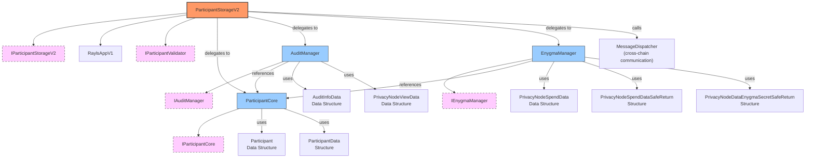

# ParticipantStorage V2 - Modular Architecture

## Overview

ParticipantStorageV2 is a refactored version of the original ParticipantStorageV1 contract that implements a modular architecture based on composition. This approach provides several key advantages:

- **Modularidade**: Each module manages a specific set of functionality, making the code more maintainable.
- **Size Constraints**: Avoids reaching the 24KB Solidity contract limit by dividing functionality across multiple contracts.
- **Upgradeability**: Individual modules can be updated independently without affecting the entire system.
- **Security**: Isolation of functionality reduces the attack surface and enhances security.
- **Backward Compatibility**: Maintains the same external interface as V1, making it a drop-in replacement.

## Architecture

The system consists of the following components:

### Main Contract

- **ParticipantStorageV2**: The main contract that delegates functionality to specialized modules.

### Modules

- **ParticipantCore**: Manages the core participant functionality including registration, updates, and validation.
- **AuditManager**: Manages audit information and chain data for participants.
- **EnygmaManager**: Manages Enygma-related functionality including baby jubjub keys and account permissions.

### Interfaces

- **IParticipantStorageV2**: Interface for the main contract.
- **IParticipantCore**: Interface for the ParticipantCore module.
- **IAuditManager**: Interface for the AuditManager module.
- **IEnygmaManager**: Interface for the EnygmaManager module.

## Architecture Diagram

### Component Relationships

The following diagram shows the relationship between all components in the ParticipantStorageV2 architecture, including interfaces, data structures, and dependencies:



### Basic Structure

The core architecture follows a composition pattern where the main contract delegates operations to specialized modules:

```
┌─────────────────────────────────────────┐
│                                         │
│          ParticipantStorageV2           │
│                                         │
└────────────────┬─────────────┬─────────┘
                 │             │             
    ┌────────────▼───┐   ┌─────▼──────┐   ┌─────────────┐
    │                │   │            │   │             │
    │ ParticipantCore│◄──┤AuditManager│◄──┤EnygmaManager│
    │                │   │            │   │             │
    └────────────────┘   └────────────┘   └─────────────┘
```

## Module Responsibilities

### 1. ParticipantCore Module

Responsible for the fundamental participant management functionality:

- Participant registration and updates
- Status and role management
- Participant validation
- Cross-chain participant data broadcasting
- Permission management for broadcast messages

### 2. AuditManager Module

Manages audit-related information:

- Audit information storage and retrieval
- Chain information management
- Private ledger data tracking

### 3. EnygmaManager Module

Handles all Enygma-related functionality:

- Baby jubjub public key management
- PN addresses and permissions
- Account validation for Enygma operations

## Deployment Process

The deployment process involves multiple steps:

1. Deploy module implementations (ParticipantCore, AuditManager, EnygmaManager)
2. Deploy proxies for each module
3. Deploy the ParticipantStorageV2 contract
4. Configure ParticipantStorageV2 with module addresses using `configureModules()`

The `configureModules()` function allows setting up all modules in a single transaction:

```solidity
function configureModules(
    address _participantCore,
    address _auditManager,
    address _enygmaManager
) external onlyOwner {
    // Set up all module references in one transaction
}
```

## Deployment and Operation

The following diagrams illustrate the deployment process, upgrade mechanisms, and runtime operations of the ParticipantStorageV2 system:

```mermaid
flowchart TD
    subgraph "Deployment Process"
        D1[Deploy Module Implementations] --> D2[Deploy Module Proxies]
        D2 --> D3[Deploy ParticipantStorageV2]
        D3 --> D4[Configure All Modules]
    end
    
    subgraph "Module Upgrade Process"
        direction LR
        U1[Deploy New Module Implementation] --> U2{Upgrade Type?}
        U2 -- "Implementation Upgrade" --> U3[Update Proxy to<br/>New Implementation]
        U2 -- "Replace Module" --> U4[Deploy New Module<br/>and Configure Proxy]
        U4 --> U5[Call Setter in<br/>ParticipantStorageV2]
    end
    
    subgraph "Runtime Module Interaction"
        R1[External Call] --> R2[ParticipantStorageV2]
        R2 --> R3{Function Type?}
        R3 -- "Participant Management" --> R4[ParticipantCore]
        R3 -- "Audit Operations" --> R5[AuditManager]
        R3 -- "Enygma Operations" --> R6[EnygmaManager]
    end
```



### Module Initialization Flow

The deployment sequence follows these steps:

```
┌─────────────────────┐     ┌─────────────────────┐     ┌─────────────────────┐
│                     │     │                     │     │                     │
│  Deploy Module      │────►│  Deploy Module      │────►│   Deploy Main       │
│  Implementations    │     │  Proxies            │     │   Contract          │
│                     │     │                     │     │                     │
└─────────────────────┘     └─────────────────────┘     └──────────┬──────────┘
                                                                  │
                                                                  │
                                                        ┌─────────▼──────────┐
                                                        │                    │
                                                        │  Configure Modules  │
                                                        │                    │
                                                        └────────────────────┘
```

## Upgrading Modules

There are two ways to upgrade modules:

### 1. Upgrading Module Implementation

To upgrade a module implementation:

1. Deploy a new implementation of the module
2. Update the module's proxy to point to the new implementation
3. No changes needed in ParticipantStorageV2

### 2. Replacing a Module

To completely replace a module:

1. Deploy a new module
2. Use the corresponding setter method in ParticipantStorageV2:
   - `setParticipantCore()`
   - `setAuditManager()`
   - `setEnygmaManager()`

## Module Interactions

```
┌───────────────────────────────────────────────────┐
│                                                   │
│               ParticipantStorageV2                │
│                                                   │
└───┬───────────────────┬───────────────────┬───────┘
    │                   │                   │
    │                   │                   │
    ▼                   ▼                   ▼
┌─────────────┐   ┌──────────────┐   ┌─────────────┐
│             │   │              │   │             │
│Participant  │   │  Audit       │   │  Enygma     │
│Core         │   │  Manager     │   │  Manager    │
│             │   │              │   │             │
└─────────────┘   └──────────────┘   └─────────────┘
    │                  ▲                  ▲
    │                  │                  │
    └──────────────────┴──────────────────┘
         Module cross-communication
```

The modules can interact with each other as needed. For instance:
- AuditManager and EnygmaManager both reference ParticipantCore to validate participants
- ParticipantStorageV2 delegates calls to the appropriate modules based on the functionality requested

## Benefits of This Architecture

1. **Maintainability**: Each module has a clear, focused responsibility
2. **Flexibility**: Modules can be replaced or upgraded independently
3. **Scalability**: New functionality can be added by creating new modules
4. **Reduced Contract Size**: Avoids hitting Solidity size limits
5. **Enhanced Security**: Functionality isolation reduces the attack surface
6. **Simplified Upgrades**: Modules can be upgraded individually without affecting the entire system

## Data Structures

The core data structures are maintained from V1 for compatibility and are defined in the `ParticipantStructs` library:

### Enums

```solidity
enum Status {
    NEW,        // Newly registered participant
    ACTIVE,     // Active and operational participant
    INACTIVE,   // Temporarily inactive participant
    FROZEN      // Frozen participant (suspended)
}

enum Role {
    PARTICIPANT, // Standard network participant
    ISSUER,      // Token issuer participant
    AUDITOR      // Audit participant
}
```

### Core Structs

```solidity
struct Participant {
    uint256 chainId;              // Chain identifier
    Role role;                    // Participant role in the network
    Status status;                // Current participant status
    string ownerId;               // Owner identifier
    string name;                  // Participant name
    uint256 createdAt;            // Creation timestamp
    uint256 updatedAt;            // Last update timestamp
    bool allowedToBroadcast;      // Permission to broadcast messages
}

struct ParticipantData {
    uint256 chainId;              // Chain identifier
    Role role;                    // Participant role
    string ownerId;               // Owner identifier
    string name;                  // Participant name
    bool allowedToBroadcast;      // Broadcast permission
}
```

### Audit and Chain Information

```solidity
struct AuditInfoData {
    uint256 chainId;                          // Chain identifier
    string raylsViewPublicKey;                // Public key for audit operations
    bytes encryptedRaylsViewPrivateKey;       // Encrypted private key
    bytes mac;                                // Message authentication code
    uint256 blockNumber;                      // Block number when data was recorded
}

struct PrivacyNodeViewData {
    uint256 chainId;              // Chain identifier
    string raylsViewPublicKey;    // Public key for private ledger
    uint256 blockNumber;          // Block number when data was recorded
}
```

### Enygma-Specific Data

```solidity
struct PrivacyNodeSpendData {
    uint256 paymentSpendPublicKey; // Payment spend public key
    address[] pnAddresses;         // Array of privacy node addresses
    uint256 chainId;               // Chain identifier
}

struct PrivacyNodeSpendDataSafeReturn {
    uint256 paymentSpendPublicKey; // Payment spend public key
    address[] pnAddresses;         // Array of privacy node addresses
    uint256 chainId;               // Chain identifier
}

struct PrivacyNodeDataEnygmaSecretSafeReturn {
    uint256 secret;                // Secret value for Enygma operations
    uint256 chainId;               // Chain identifier
}
```

## Usage

The ParticipantStorageV2 contract provides the same interface as ParticipantStorageV1, making it a direct replacement. It delegates calls to the appropriate modules based on the requested functionality.

### Example: Function Delegation

When ParticipantStorageV2 receives a call to a Participant management function, it delegates to the appropriate module:

```solidity
// In ParticipantStorageV2.sol
function addParticipant(ParticipantStructs.ParticipantData memory _participant) external onlyOwner {
    require(address(participantCore) != address(0), "ParticipantStorageV2: ParticipantCore module not set");
    participantCore.addParticipant(_participant);
}

// Example of creating a ParticipantData struct
ParticipantStructs.ParticipantData memory newParticipant = ParticipantStructs.ParticipantData({
    chainId: 1,
    role: ParticipantStructs.Role.PARTICIPANT,
    ownerId: "owner123",
    name: "Test Participant",
    allowedToBroadcast: true
});
```

### Example: Module Configuration

```solidity
// Configure all modules in a single transaction
function configureModules(
    address _participantCore,
    address _auditManager,
    address _enygmaManager
) external onlyOwner {
    require(_participantCore != address(0), "ParticipantStorageV2: ParticipantCore address cannot be zero");
    require(_auditManager != address(0), "ParticipantStorageV2: AuditManager address cannot be zero");
    require(_enygmaManager != address(0), "ParticipantStorageV2: EnygmaManager address cannot be zero");
    
    participantCore = IParticipantCore(_participantCore);
    auditManager = IAuditManager(_auditManager);
    enygmaManager = IEnygmaManager(_enygmaManager);
    
    emit ModulesConfigured(_participantCore, _auditManager, _enygmaManager);
}
```

### External Interface Compatibility

External contracts interacting with ParticipantStorageV2 will use the same interface as before, making the migration from V1 to V2 seamless:

```solidity
// External code interacting with ParticipantStorage
IParticipantValidator participantValidator = IParticipantValidator(participantStorageAddress);
participantValidator.validateMessageParticipants(originChainId, destinationChainId);

// Example of working with Enygma data structures
ParticipantStructs.PrivacyNodeSpendData memory enygmaData = ParticipantStructs.PrivacyNodeSpendData({
    paymentSpendPublicKey: 123456789,
    pnAddresses: new address[](2),
    chainId: 1
});
enygmaData.pnAddresses[0] = 0x1234567890123456789012345678901234567890;
enygmaData.pnAddresses[1] = 0x0987654321098765432109876543210987654321;
``` 