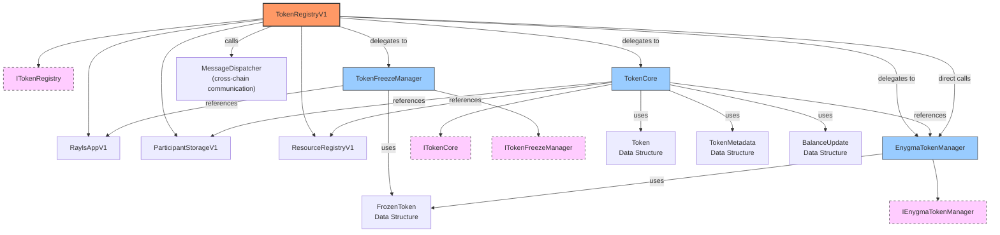
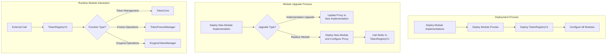

# TokenRegistry V1 - Modular Architecture

## Overview

TokenRegistryV1 is a modular contract that implements a composition-based architecture for token management in the Rayls protocol. This approach provides several key advantages:

- **Modularidade**: Each module manages a specific set of functionality, making the code more maintainable.
- **Size Constraints**: Avoids reaching the 24KB Solidity contract limit by dividing functionality across multiple contracts.
- **Upgradeability**: Individual modules can be updated independently without affecting the entire system.
- **Security**: Isolation of functionality reduces the attack surface and enhances security.
- **Specialization**: Each module focuses on a specific aspect of token management.

## Architecture

The system consists of the following components:

### Main Contract

- **TokenRegistryV1**: The main contract that delegates functionality to specialized modules.

### Modules

- **TokenCore**: Manages the core token functionality including registration, updates, and lifecycle management.
- **TokenFreezeManager**: Manages token freezing and unfreezing functionality across participants.
- **EnygmaTokenManager**: Manages Enygma-specific token operations including freezing and registration.

### Interfaces

- **ITokenRegistry**: Interface for the main contract.
- **ITokenCore**: Interface for the TokenCore module.
- **ITokenFreezeManager**: Interface for the TokenFreezeManager module.
- **IEnygmaTokenManager**: Interface for the EnygmaTokenManager module.

## Architecture Diagram

### Component Relationships

The following diagram shows the relationship between all components in the TokenRegistryV1 architecture, including interfaces, data structures, and dependencies:



### Basic Structure

The core architecture follows a composition pattern where the main contract delegates operations to specialized modules:

```
┌─────────────────────────────────────────┐
│                                         │
│            TokenRegistryV1              │
│                                         │
└────────────────┬─────────────┬─────────┘
                 │             │             
    ┌────────────▼───┐   ┌─────▼──────┐   ┌─────────────┐
    │                │   │            │   │             │
    │   TokenCore    │◄──┤TokenFreeze │◄──┤  Enygma    │
    │                │   │ Manager    │   │   Token    │
    └────────────────┘   └────────────┘   │  Manager   │
                                          └─────────────┘
```

**Note**: The arrows (◄──) indicate that TokenRegistryV1 delegates calls to the respective modules. The EnygmaTokenManager is directly connected to TokenRegistryV1 for specialized operations, while also being referenced by TokenCore for integration purposes. All modules operate independently but can communicate with each other when necessary.

## Module Responsibilities

### 1. TokenCore Module

Responsible for the fundamental token management functionality:

- Token registration and lifecycle management
- Token status updates (NEW, ACTIVE, INACTIVE)
- Balance update tracking and broadcasting
- Integration with Enygma token management
- Participant validation and authorization

### 2. TokenFreezeManager Module

Manages token freezing functionality:

- Freeze/unfreeze tokens for specific participants
- Track frozen tokens and their participants
- Broadcast freeze status changes to all participants
- Synchronize freeze data with new participants

### 3. EnygmaTokenManager Module

Handles all Enygma-specific token operations:

- Enygma token registration
- Enygma token freezing/unfreezing
- Integration with Enygma factory
- Specialized Enygma token events

## Deployment Process

The deployment process involves multiple steps:

1. Deploy module implementations (TokenCore, TokenFreezeManager, EnygmaTokenManager)
2. Deploy proxies for each module
3. Deploy the TokenRegistryV1 contract
4. Configure TokenRegistryV1 with module addresses using `configureModules()`

The `configureModules()` function allows setting up all modules in a single transaction:

```solidity
function configureModules(
    address _tokenCore,
    address _tokenFreezeManager,
    address _enygmaTokenManager
) external onlyOwner {
    // Set up all module references in one transaction
}
```

## Deployment and Operation

The following diagrams illustrate the deployment process, upgrade mechanisms, and runtime operations of the TokenRegistryV1 system:



### Module Initialization Flow

The deployment sequence follows these steps:

```
┌─────────────────────┐     ┌─────────────────────┐     ┌─────────────────────┐
│                     │     │                     │     │                     │
│  Deploy Module      │────►│  Deploy Module      │────►│   Deploy Main       │
│  Implementations    │     │  Proxies            │     │   Contract          │
│                     │     │                     │     │                     │
└─────────────────────┘     └─────────────────────┘     └──────────┬──────────┘
                                                                  │
                                                                  │
                                                        ┌─────────▼──────────┐
                                                        │                    │
                                                        │  Configure Modules  │
                                                        │                    │
                                                        └────────────────────┘
```

## Upgrading Modules

There are two ways to upgrade modules:

### 1. Upgrading Module Implementation

To upgrade a module implementation:

1. Deploy a new implementation of the module
2. Update the module's proxy to point to the new implementation
3. No changes needed in TokenRegistryV1

### 2. Replacing a Module

To completely replace a module:

1. Deploy a new module
2. Use the corresponding setter method in TokenRegistryV1:
   - `setTokenCore()`
   - `setTokenFreezeManager()`
   - `setEnygmaTokenManager()`

## Module Interactions

```
┌───────────────────────────────────────────────────┐
│                                                   │
│               TokenRegistryV1                     │
│                                                   │
└───┬───────────────────┬───────────────────┬───────┘
    │                   │                   │
    │                   │                   │
    ▼                   ▼                   ▼
┌─────────────┐   ┌──────────────┐   ┌─────────────┐
│             │   │              │   │             │
│  TokenCore  │   │  TokenFreeze │   │   Enygma    │
│             │   │  Manager     │   │   Token    │
│             │   │              │   │  Manager   │
└─────────────┘   └──────────────┘   └─────────────┘
    │                  ▲                  ▲
    │                  │                  │
    └──────────────────┴──────────────────┘
         Module cross-communication
```

The modules can interact with each other as needed. For instance:
- **TokenCore** references EnygmaTokenManager for specialized operations
- **TokenFreezeManager** communicates with RaylsApp for cross-chain messaging
- **TokenRegistryV1** delegates calls to the appropriate modules based on the functionality requested
- **EnygmaTokenManager** is directly accessible from TokenRegistryV1 for specialized Enygma operations (freeze/unfreeze, factory management)

## Benefits of This Architecture

1. **Maintainability**: Each module has a clear, focused responsibility
2. **Flexibility**: Modules can be replaced or upgraded independently
3. **Scalability**: New functionality can be added by creating new modules
4. **Reduced Contract Size**: Avoids hitting Solidity size limits
5. **Enhanced Security**: Functionality isolation reduces the attack surface
6. **Simplified Upgrades**: Modules can be upgraded individually without affecting the entire system

## Data Structures

The core data structures are defined in the `TokenStructs` library:

### Enums

```solidity
enum TokenStatus {
    NEW,        // Newly registered token
    ACTIVE,     // Active and operational token
    INACTIVE    // Inactive token
}
```

### Core Structs

```solidity
struct Token {
    bytes32 resourceId;                    // Unique resource identifier
    string name;                           // Token name
    string symbol;                         // Token symbol
    uint256 issuerChainId;                // Chain ID of the token issuer
    address issuerImplementationAddress;   // Address for resource ID reply
    bool isFungible;                       // Whether token is fungible
    TokenStatus status;                    // Current token status
    uint256 createdAt;                     // Creation timestamp
    uint256 updatedAt;                     // Last update timestamp
    TokenMetadata metadata;                // Token metadata
    SharedObjects.ErcStandard ercStandard; // ERC standard (20, 721, 1155)
}

struct TokenMetadata {
    string url;                            // Token metadata URL
    uint8 decimals;                        // Token decimal places
}

struct BalanceUpdate {
    uint256 amount;                        // Amount of tokens
    uint256 ercId;                         // ERC token ID (for 721/1155)
}

struct FrozenToken {
    bytes32 resourceId;                    // Resource ID of the frozen token
    uint256[] frozenParticipants;          // Array of frozen participant chain IDs
}
```

## Usage

The TokenRegistryV1 contract provides a unified interface for token management operations, delegating calls to the appropriate modules based on the requested functionality.

### Example: Function Delegation

When TokenRegistryV1 receives a call to a token management function, it delegates to the appropriate module:

```solidity
// In TokenRegistryV1.sol
function addToken(SharedObjects.TokenRegistrationData calldata tokenData) external virtual returns (bytes32) {
    require(address(tokenCore) != address(0), 'TokenRegistryV1: TokenCore module not set');
    return tokenCore.addToken(tokenData, msg.sender);
}

// Example of creating a TokenRegistrationData struct
SharedObjects.TokenRegistrationData memory tokenData = SharedObjects.TokenRegistrationData({
    name: "Test Token",
    symbol: "TEST",
    issuerChainId: 1,
    issuerImplementationAddress: 0x1234567890123456789012345678901234567890,
    isFungible: true,
    metadata: SharedObjects.TokenMetadata({
        url: "https://example.com/metadata",
        decimals: 18
    }),
    ercStandard: SharedObjects.ErcStandard.ERC20
});
```

### Example: Module Configuration

```solidity
// Configure all modules in a single transaction
function configureModules(
    address _tokenCore,
    address _tokenFreezeManager,
    address _enygmaTokenManager
) external onlyOwner {
    require(_tokenCore != address(0), "TokenRegistryV1: TokenCore address cannot be zero");
    require(_tokenFreezeManager != address(0), "TokenRegistryV1: TokenFreezeManager address cannot be zero");
    require(_enygmaTokenManager != address(0), "TokenRegistryV1: EnygmaTokenManager address cannot be zero");
    
    tokenCore = ITokenCore(_tokenCore);
    tokenFreezeManager = ITokenFreezeManager(_tokenFreezeManager);
    enygmaTokenManager = IEnygmaTokenManager(_enygmaTokenManager);
    
    emit ModulesConfigured(_tokenCore, _tokenFreezeManager, _enygmaTokenManager);
}
```

### External Interface Compatibility

External contracts interacting with TokenRegistryV1 will use the same interface as before, making the migration seamless:

```solidity
// External code interacting with TokenRegistry
ITokenRegistry tokenRegistry = ITokenRegistry(tokenRegistryAddress);
bytes32 resourceId = tokenRegistry.addToken(tokenData);

// Example of working with token data structures
TokenStructs.Token memory token = tokenRegistry.getTokenByResourceId(resourceId);
require(token.status == TokenStructs.TokenStatus.ACTIVE, "Token is not active");

// Example of working with frozen tokens
TokenStructs.FrozenToken memory frozenToken = TokenStructs.FrozenToken({
    resourceId: resourceId,
    frozenParticipants: new uint256[](2)
});
frozenToken.frozenParticipants[0] = 1;
frozenToken.frozenParticipants[1] = 2;
```

## Cross-Chain Communication

The TokenRegistryV1 system integrates with the Rayls protocol for cross-chain communication:

- **Token Registration**: Tokens are registered on the private network hub and broadcast to all participants
- **Balance Updates**: Token balance changes are communicated across chains
- **Freeze Status**: Token freeze/unfreeze operations are synchronized across all participants
- **New Participants**: New participants receive current frozen token status

## Security Features

1. **Access Control**: Only the contract owner can configure modules and perform administrative operations
2. **Module Isolation**: Each module has limited access to other modules
3. **Validation**: Participant validation through ParticipantStorage integration
4. **Cross-Chain Security**: Secure messaging through Rayls protocol endpoints
5. **Upgrade Safety**: UUPS upgrade pattern with owner-only upgrade authorization

## Integration Points

The TokenRegistryV1 system integrates with several external systems:

- **ParticipantStorage**: For participant validation and authorization
- **ResourceRegistry**: For resource management and registration
- **Rayls Protocol**: For cross-chain communication and messaging
- **Enygma Protocol**: For specialized Enygma token operations
- **Token Registry Replicas**: For participant chain synchronization
