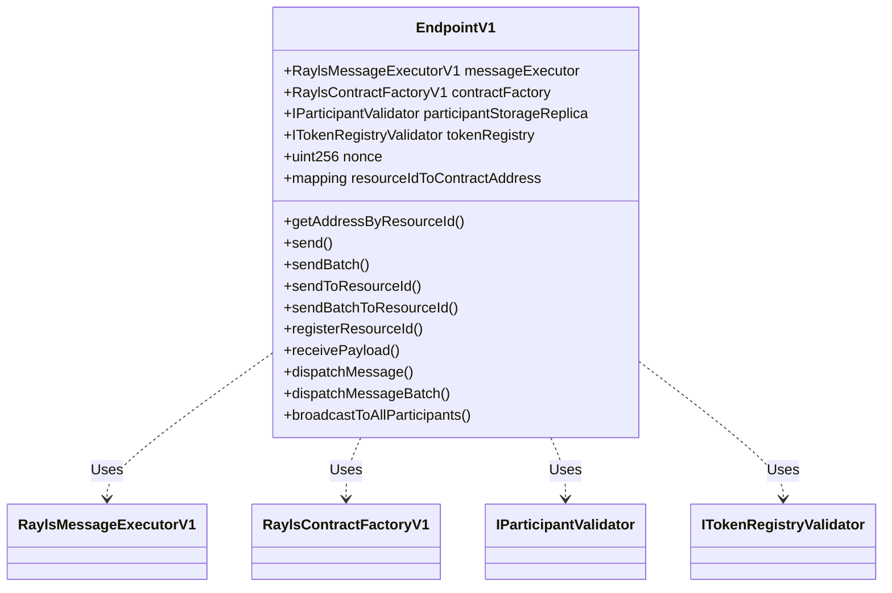
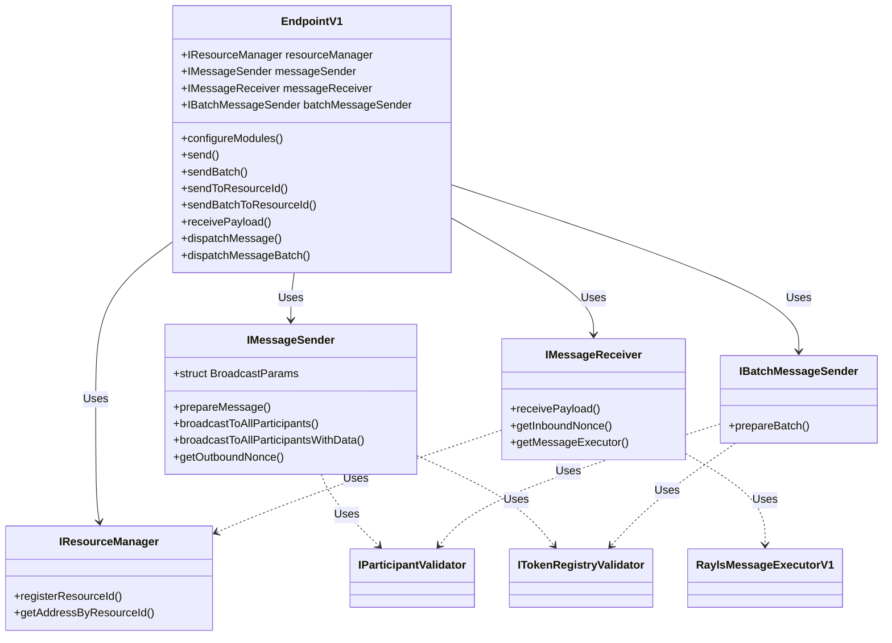
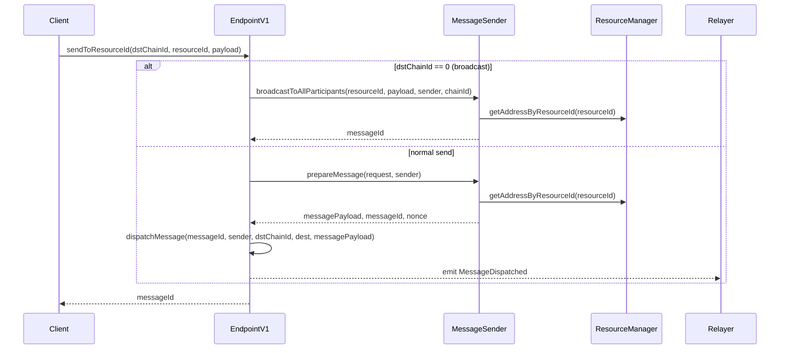
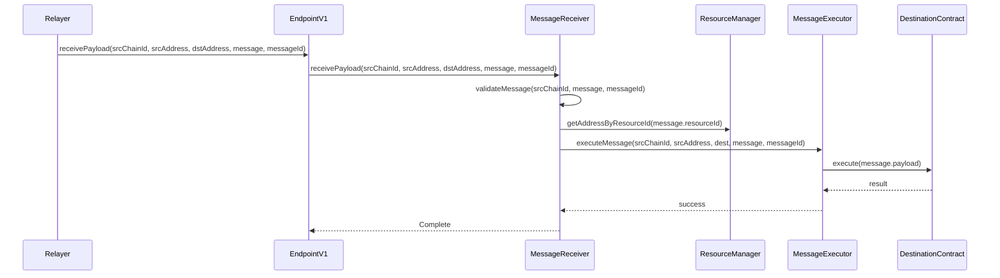
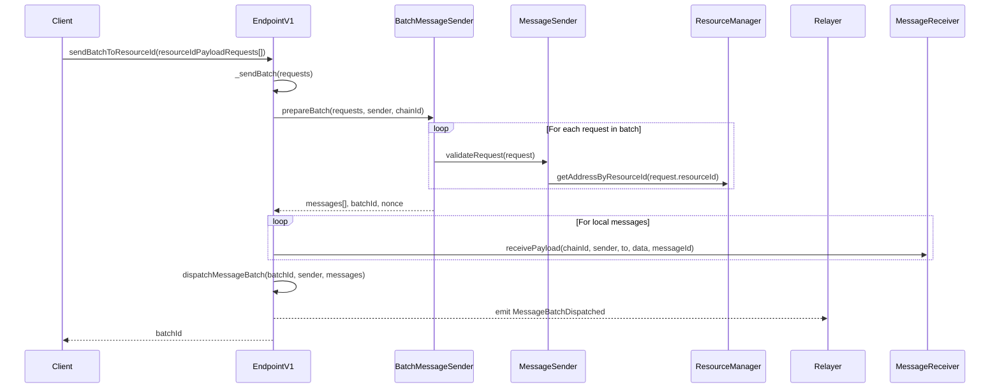
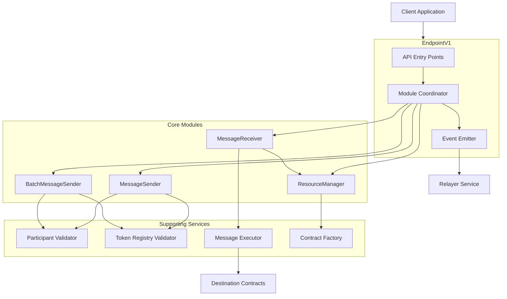

# Modular Architecture of the Rayls Protocol

This documentation details the migration from the monolithic EndpointV1 architecture to a scalable and maintainable modular architecture.

## Architecture Diagrams

### Previous Architecture (Monolithic)



### New Modular Architecture



## Message Sending Flow



## Message Receiving Flow



## Batch Message Sending Flow



## System Component Diagram



## Overview of the New Architecture

The modular architecture divides the EndpointV1 into specialized modules with well-defined responsibilities:

1. **ResourceManager**: Manages resource IDs and their mapping to contract addresses
2. **MessageSender**: Manages message preparation and sending
3. **MessageReceiver**: Manages message reception, validation, and access to the MessageExecutor
4. **BatchMessageSender**: Manages batch message sending

## Architecture Comparison

### Previous Architecture (Monolithic)

In the monolithic architecture, EndpointV1 was responsible for all protocol functions:

- Managing resource IDs and associated contracts
- Preparing, sending, and validating messages
- Receiving and processing messages
- Managing nonces for each chain
- Sending messages in batches
- Verifying participant and token permissions
- Broadcasting messages to multiple destinations
- Direct access to MessageExecutor for message execution

This resulted in:
- Contracts with thousands of lines of code
- Complex functions subject to the "Stack too deep" error
- Difficulty in maintenance and testing
- Reaching Solidity contract size limits (24KB)

### New Architecture (Modular)

In the modular architecture, responsibilities are clearly divided:

| Module | Responsibilities |
|--------|-------------------|
| **EndpointV1** | API entry point, module coordination, and event emission |
| **ResourceManager** | Management and resolution of resource IDs to contract addresses |
| **MessageSender** | Message preparation, send validation, broadcasting, and outbound nonce management |
| **MessageReceiver** | Message reception, validation, access to MessageExecutor, and forwarding to the executor |
| **BatchMessageSender** | Batch message sending management |

## Key Changes Made

### 1. MessageSender Refactoring

One of the main changes was the refactoring of MessageSender to resolve the "Stack too deep" problem:

#### Before (Monolithic)
```solidity
// In EndpointV1
function broadcastToAllParticipants(
    bytes32 _resourceId,
    bytes calldata _payload,
    bytes memory _lockData,
    bytes memory _revertDataSender,
    bytes memory _revertDataReceiver,
    BridgedTransferMetadata memory transferMetadata,
    address _sender,
    uint256 _chainId
) external returns (bytes32 messageId) {
    // Implementation with many parameters causing "Stack too deep"
}
```

#### After (Modular with Struct)
```solidity
// Interface IMessageSender
struct BroadcastParams {
    bytes32 resourceId;
    bytes payload;
    bytes lockData;
    bytes revertDataSender;
    bytes revertDataReceiver;
    BridgedTransferMetadata transferMetadata;
    address sender;
    uint256 chainId;
}

function broadcastToAllParticipantsWithData(
    BroadcastParams calldata params
) external returns (bytes32 messageId);
```

### 2. IMessageSender Interface Implementation

We created a clear interface for MessageSender:

```solidity
interface IMessageSender {
    struct BroadcastParams {
        bytes32 resourceId;
        bytes payload;
        bytes lockData;
        bytes revertDataSender;
        bytes revertDataReceiver;
        BridgedTransferMetadata transferMetadata;
        address sender;
        uint256 chainId;
    }
    
    function setParticipantValidator(address _participantValidator) external;
    
    function setTokenValidator(address _tokenValidator) external;
    
    function getOutboundNonce(uint256 _dstChainId) external view returns (uint256);
    
    function prepareMessage(
        SendRequest memory request,
        address sender
    ) external returns (RaylsMessage memory messagePayload, bytes32 messageId, uint256 nonce);
    
    function broadcastToAllParticipants(
        bytes32 _resourceId,
        bytes calldata _payload,
        address _sender,
        uint256 _chainId
    ) external returns (bytes32 messageId);
    
    function broadcastToAllParticipantsWithData(
        BroadcastParams calldata params
    ) external returns (bytes32 messageId);
}
```

### 3. IMessageReceiver Interface Implementation

We created an interface for MessageReceiver that includes access to MessageExecutor:

```solidity
interface IMessageReceiver {
    function receivePayload(
        uint256 _srcChainId, 
        address _srcAddress, 
        address _dstAddress, 
        RaylsMessage memory _raylsMessage, 
        bytes32 _messageId
    ) external;
    
    function getInboundNonce(uint256 _srcChainId) external view returns (uint256);
    
    function getMessageExecutor() external view returns (address);
}
```

### 4. EndpointV1 Refactoring

EndpointV1 was refactored to delegate responsibilities to modules:

```solidity
// EndpointV1.sol
// New modules of the architecture
IResourceManager public resourceManager;
IMessageSender public messageSender;
IMessageReceiver public messageReceiver;
IBatchMessageSender public batchMessageSender;

// Unified configuration method
function configureEndpoint(
    address _contractFactory,
    address _participantStorageReplica,
    address _tokenRegistry,
    address _resourceManager,
    address _messageSender,
    address _messageReceiver,
    address _batchMessageSender
) external virtual onlyOwner {
    // Configure legacy contracts
    contractFactory = RaylsContractFactoryV1(_contractFactory);
    participantStorageReplica = IParticipantValidator(_participantStorageReplica);
    tokenRegistry = ITokenRegistryValidator(_tokenRegistry);
    
    // Configure modules
    resourceManager = IResourceManager(_resourceManager);
    messageSender = IMessageSender(_messageSender);
    messageReceiver = IMessageReceiver(_messageReceiver);
    batchMessageSender = IBatchMessageSender(_batchMessageSender);
    
    emit EndpointConfigured(
        _contractFactory,
        _participantStorageReplica,
        _tokenRegistry,
        _resourceManager,
        _messageSender,
        _messageReceiver,
        _batchMessageSender
    );
}

// Method to retrieve current configuration
function getEndpointConfiguration() external view returns (
    address _contractFactory,
    address _participantStorageReplica,
    address _tokenRegistry,
    address _resourceManager,
    address _messageSender,
    address _messageReceiver,
    address _batchMessageSender
) {
    return (
        address(contractFactory),
        address(participantStorageReplica),
        address(tokenRegistry),
        address(resourceManager),
        address(messageSender),
        address(messageReceiver),
        address(batchMessageSender)
    );
}
```

### 5. Function Signature Changes

The `configureContracts` function was modified to remove direct dependency on MessageExecutor:

#### Before:
```solidity
function configureContracts(
    address _messageExecutor, 
    address _contractFactory, 
    address _participantStorageReplica, 
    address _tokenRegistry
) external virtual onlyOwner {
    messageExecutor = RaylsMessageExecutorV1(_messageExecutor);
    contractFactory = RaylsContractFactoryV1(_contractFactory);
    participantStorageReplica = IParticipantValidator(_participantStorageReplica);
    tokenRegistry = ITokenRegistryValidator(_tokenRegistry);
}
```

#### After:
```solidity
function configureContracts(
    address _contractFactory, 
    address _participantStorageReplica, 
    address _tokenRegistry
) external virtual onlyOwner {
    contractFactory = RaylsContractFactoryV1(_contractFactory);
    participantStorageReplica = IParticipantValidator(_participantStorageReplica);
    tokenRegistry = ITokenRegistryValidator(_tokenRegistry);
}
```

### 6. Trusted Executor Verification Changes

The `isTrustedExecutor` function was modified to get the MessageExecutor through MessageReceiver:

#### Before:
```solidity
function isTrustedExecutor(address _executor) public view virtual returns (bool) {
    return _executor == address(messageExecutor);
}
```

#### After:
```solidity
function isTrustedExecutor(address _executor) public view virtual returns (bool) {
    return _executor == address(messageReceiver.getMessageExecutor());
}
```

### 7. Broadcast Logic Changes

The broadcast logic with `dstChainId == 0` was moved from the `_send` method and delegated to MessageSender:

#### Before:
```solidity
function sendToResourceId(uint256 _dstChainId, bytes32 _resourceId, bytes calldata _payload) external payable virtual returns (bytes32 messageId) {
    // ...
    
    // Broadcast case (dstChainId = 0)
    if (_dstChainId == 0) {
        IMessageSender.BroadcastParams memory params = IMessageSender.BroadcastParams({
            resourceId: _resourceId,
            payload: _payload,
            lockData: _lockData,
            revertDataSender: _revertDataSender,
            revertDataReceiver: _revertDataReceiver,
            transferMetadata: transferMetadata,
            sender: msg.sender,
            chainId: chainId
        });
        messageId = messageSender.broadcastToAllParticipantsWithData(params);
        return messageId;
    }
    
    // Normal case (sending to a specific chain)
    return _send(/* ... */);
}
```

#### After:
```solidity
function sendToResourceId(uint256 _dstChainId, bytes32 _resourceId, bytes calldata _payload) external payable virtual returns (bytes32 messageId) {
    // ...
    
    // Broadcast case (dstChainId = 0)
    if (_dstChainId == 0) {
        messageId = messageSender.broadcastToAllParticipants(_resourceId, _payload, msg.sender, chainId);
        return messageId;
    }
    
    // Normal case (sending to a specific chain)
    return _send(/* ... */);
}
```

### 8. Configuration Approach Changes

The configuration of the EndpointV1 contract was previously split between two methods, which caused potential issues if not called in the correct order and made it difficult to understand the complete configuration at a glance:

#### Before:
```solidity
// Configure basic contracts first
function configureContracts(
    address _contractFactory, 
    address _participantStorageReplica, 
    address _tokenRegistry
) external virtual onlyOwner {
    contractFactory = RaylsContractFactoryV1(_contractFactory);
    participantStorageReplica = IParticipantValidator(_participantStorageReplica);
    tokenRegistry = ITokenRegistryValidator(_tokenRegistry);
}

// Then configure modules in a separate call
function configureModules(
    address _resourceManager,
    address _messageSender,
    address _messageReceiver,
    address _batchMessageSender
) external onlyOwner {
    resourceManager = IResourceManager(_resourceManager);
    messageSender = IMessageSender(_messageSender);
    messageReceiver = IMessageReceiver(_messageReceiver);
    batchMessageSender = IBatchMessageSender(_batchMessageSender);
    emit ModulesConfigured(_resourceManager, _messageSender, _messageReceiver, _batchMessageSender);
}
```

#### After:
```solidity
// Unified configuration method
function configureEndpoint(
    address _contractFactory,
    address _participantStorageReplica,
    address _tokenRegistry,
    address _resourceManager,
    address _messageSender,
    address _messageReceiver,
    address _batchMessageSender
) external virtual onlyOwner {
    // Configure legacy contracts
    contractFactory = RaylsContractFactoryV1(_contractFactory);
    participantStorageReplica = IParticipantValidator(_participantStorageReplica);
    tokenRegistry = ITokenRegistryValidator(_tokenRegistry);
    
    // Configure modules
    resourceManager = IResourceManager(_resourceManager);
    messageSender = IMessageSender(_messageSender);
    messageReceiver = IMessageReceiver(_messageReceiver);
    batchMessageSender = IBatchMessageSender(_batchMessageSender);
    
    emit EndpointConfigured(
        _contractFactory,
        _participantStorageReplica,
        _tokenRegistry,
        _resourceManager,
        _messageSender,
        _messageReceiver,
        _batchMessageSender
    );
}

// Method to retrieve current configuration
function getEndpointConfiguration() external view returns (
    address _contractFactory,
    address _participantStorageReplica,
    address _tokenRegistry,
    address _resourceManager,
    address _messageSender,
    address _messageReceiver,
    address _batchMessageSender
) {
    return (
        address(contractFactory),
        address(participantStorageReplica),
        address(tokenRegistry),
        address(resourceManager),
        address(messageSender),
        address(messageReceiver),
        address(batchMessageSender)
    );
}
```

The new approach consolidates all configuration in a single function call, improving contract safety by ensuring all components are properly configured in a single atomic transaction. It also provides a method to retrieve the complete current configuration, enhancing transparency and ease of debugging.

## Implemented Modules

#### ResourceManager
Responsible for managing resource IDs and resolving them to contract addresses.

```solidity
function registerResourceId(bytes32 _resourceId, address _implementationAddress) external {
    // Validates and registers the resource ID
}

function getAddressByResourceId(bytes32 _resourceId) external view returns (address) {
    // Returns the address associated with the resource ID
}
```

#### MessageSender
Manages message preparation and sending, including broadcasting to multiple destinations.

```solidity
function prepareMessage(
    SendRequest memory request,
    address sender
) external returns (RaylsMessage memory messagePayload, bytes32 messageId, uint256 nonce) {
    // Prepares the message for sending
}

function broadcastToAllParticipantsWithData(
    BroadcastParams calldata params
) external returns (bytes32 messageId) {
    // Implements broadcasting with parameters encapsulated in a struct
}
```

#### MessageReceiver
Manages message reception, validation, and execution.

```solidity
function receivePayload(
    uint256 _srcChainId, 
    address _srcAddress, 
    address _dstAddress, 
    RaylsMessage memory _raylsMessage, 
    bytes32 _messageId
) external {
    // Validates and processes the received message
}

function getMessageExecutor() external view returns (address) {
    // Returns the address of MessageExecutor
}
```

#### BatchMessageSender
Manages batch message sending.

```solidity
function prepareBatch(
    SendRequest[] memory requests,
    address sender,
    uint256 chainId
) external returns (BatchMessage[] memory messages, bytes32 batchId, uint256 nonce) {
    // Prepares a batch of messages for sending
}
```

## Deployment and Configuration Process

The deployment scripts were updated to support the new modular architecture:

### 1. Module Deployment

```typescript
// Deploy modules of the new architecture
const resourceManagerAddress = await deployResourceManager(deployer, ethers, contractFactoryAddress);
const messageSenderAddress = await deployMessageSender(deployer, ethers, chainId.toString(), participantStorageAddress, tokenRegistryAddress);
const messageReceiverAddress = await deployMessageReceiver(deployer, ethers, resourceManagerAddress, messageExecutorAddress);
const batchMessageSenderAddress = await deployBatchMessageSender(deployer, ethers, participantStorageAddress, tokenRegistryAddress);
```

### 2. Unified Configuration in EndpointV1

```typescript
// Configuration with a single call
console.log('Configuring all contracts and modules in EndpointV1...');
const configureEndpointTx = await endpointContract.getFunction('configureEndpoint').send(
  contractFactoryAddress,         // Contract Factory
  participantStorageAddress,      // Participant Storage Replica
  tokenRegistryAddress,    // Token Registry Replica
  resourceManagerAddress,         // Resource Manager
  messageSenderAddress,           // Message Sender
  messageReceiverAddress,         // Message Receiver
  batchMessageSenderAddress       // Batch Message Sender
);
await configureEndpointTx.wait(2);
```

### 3. Configuration Order

It's important to configure all components in the correct order, which is now handled by the unified configuration method:

```typescript
// All configuration in one call
await endpointContract.getFunction('configureEndpoint').send(
  contractFactoryAddress,
  participantStorageAddress,
  tokenRegistryAddress,
  resourceManagerAddress,
  messageSenderAddress,
  messageReceiverAddress,
  batchMessageSenderAddress
);

// After configuring, resource IDs can be registered
await endpointContract.registerResourceId(resourceId, implementationAddress);
```

## Benefits of the New Architecture

1. **Maintainability**: Cleaner code with well-defined responsibilities
2. **Scalability**: Easy addition of new modules and features
3. **Testability**: Modules can be tested in isolation
4. **Modularity**: Allows updates to specific modules without affecting the entire system
5. **Overcoming Technical Limitations**:
   - Resolution of the "Stack too deep" problem
   - Avoiding contract size limit (24KB)
   - Leaner and more focused functions
6. **Simplified Configuration**:
   - Unified configuration with a single function call
   - Reduced deployment complexity and potential errors
   - Clearer contract state management
   - Ability to inspect the complete configuration with a simple view function

## Execution Flow in the New Architecture

### Individual Message Sending
1. Client calls `sendToResourceId()` on EndpointV1
2. EndpointV1 checks if it's a broadcast (dstChainId = 0)
3. If it's a broadcast, it delegates to `messageSender.broadcastToAllParticipants()` with simplified parameters
4. If it's not a broadcast, it calls `_send()` which uses `messageSender.prepareMessage()`
5. The prepared message is sent via `dispatchMessage()` or processed locally

### Batch Message Sending
1. Client calls `sendBatchToResourceId()` on EndpointV1
2. EndpointV1 calls `_sendBatch()` which uses `batchMessageSender.prepareBatch()`
3. Local messages are processed immediately
4. The batch is sent via `dispatchMessageBatch()`

### Message Receiving
1. The message arrives via `receivePayload()` on EndpointV1
2. EndpointV1 delegates processing to `messageReceiver.receivePayload()`
3. MessageReceiver validates the message and executes it on the correct destination using MessageExecutor

## Next Steps for Refactoring

1. Migrate private hub related functions to a PrivateHubManager module
2. Migrate validation logic to specialized validation modules
3. Separate the message dispatch interface
4. Implement module update mechanisms without breaking backward compatibility

## Conclusion

The new modular architecture solves immediate technical problems such as "Stack too deep" and creates a solid foundation for the future growth of the protocol. The clear division of responsibilities facilitates maintenance, testing, and system evolution, while maintaining compatibility with existing systems.

The main changes include:
1. Removal of direct reference to MessageExecutor in EndpointV1
2. Changing the configureContracts function signature
3. Modification of the isTrustedExecutor function to use MessageReceiver
4. Simplification of broadcast logic
5. Clear organization of responsibilities between modules
6. Unified configuration approach with a single method and configuration inspection capability 